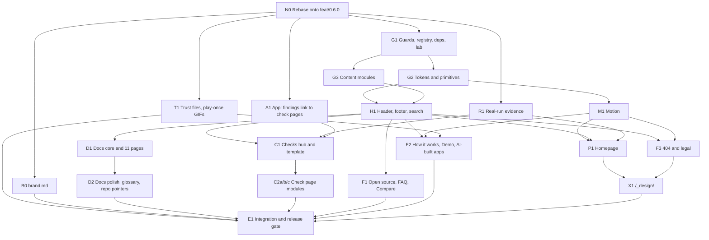

# Run Hound site redesign: the final design

Written 2026-09-27. This is the design the redesign is built from. It picks one of the three prototype directions, grafts
the best ideas of the other two onto it, fixes every must-change the three judges found, and ends with a build contract
for implementation in `<redesign worktree>` (branch `site/redesign`, rebased onto `feat/0.6.0`
first).

- **Inputs.** `site-research/BRIEF.md`, overridden by `site-research/USER-DECISIONS.md` where they differ. The three
  directions: `site-design/evidence/SPEC.md` (prototype `evidence/site/`), `site-design/terminal/SPEC.md`
  (prototype `terminal/`) and `site-design/hound/SPEC.md` (prototype `hound/`). The judges: `judge-visitor.md`,
  `judge-engineering.md` and `judge-brand-motion.md`. The real 0.6.0 run on Kennel: `site-design/kennel-run/`.
- **Paths.** `site-design/…` and `site-research/…` are under
  `<research scratch folder>/`. `site/…` means
  the site in the redesign worktree. `app/…`, `docs/…` and root files mean the redesign worktree after the rebase.
- **Checked today.** The redesign worktree is at `f6534e1`, and `feat/0.6.0` (`e2efe48`) descends from it with 4 commits,
  so the rebase is a fast-forward with no conflicts. The 0.6.0 tree has 26 built-in checks plus the optional `ai-flow`
  (`app/src/core/types.ts` `CHECK_IDS`, `site/src/components/checks/data.ts`). Next 16.3.5 treats `_folder` as a private
  folder, so `/_design/` lives at `site/src/app/%5Fdesign/` (`next/dist/docs/01-app/01-getting-started/02-project-structure.md:281`).
  `report.html` is already served with `sandbox allow-popups allow-popups-to-escape-sandbox` and the web UI with
  `Referrer-Policy: no-referrer` (`app/src/server/app.ts:256, 263-265`), so a finding can link out to the site safely.
  `ScrollTrigger.enable()` re-enables every trigger it disabled (`gsap@3.15.0` `ScrollTrigger.js:2150-2151`), so it can
  be parked and resumed.
- **Nothing in either repository was changed.** The copy counts in §3.1 were computed with the brief's word regex by
  `site-design/work/final/copy.mjs`.

---

## 0. The decisions at a glance

| # | Topic | Decision |
|---|---|---|
| 1 | Direction | **Evidence first** (21.0 of 30), with terminal's conversion paths and scroll runtime and hound's search, inner pages, token parser and 404 grafted on |
| 2 | Homepage | 8 blocks, **722 words** (gate 750), 7 h2, 17 h3, 0 tablists, 0 hidden words; "free" and "your machine" in the first viewport; every check mention links to its page |
| 3 | Primary CTA | "Try it locally" → **`/docs/quick-start/`**, a real page of about 3 screens (the docs split ships in 0.6.0) |
| 4 | Header | `Docs · Checks · Demo · AI-built apps · Open source`, then **working** Search (Ctrl K), `v0.6.0`, GitHub, Try it locally; static at 400% zoom; the menu keeps keyboard focus |
| 5 | Motion | One hero run (2.7 s, once, bug on screen about 2 s after it starts, and by 3.6 s from navigation at worst on desktop); one scrubbed pipeline (the only ScrollTrigger); one-shot evidence, card and figure effects; the 404 hound. No text ever moves |
| 6 | Accent | At most one strong mint object per view at rest outside the exempt uses (primary button, links, focus, the h1's key words, status marks in product figures) |
| 7 | The hound | The mark never moves. A traced line hound appears at most once per page: resting at the homepage's close, walking on the 404 |
| 8 | Reference | 11 docs pages + hub + glossary (MDX), 26 check pages from real runs, Pagefind search, all in 0.6.0 |
| 9 | App | Each finding in `report.html`, `report.md` and the web UI links to `https://run-hound.rahulbharati.com/checks/<id>/` |
| 10 | Budgets | Enforced by the build and a Playwright lab: words, screens, LCP, CLS, JS, HTML, rAF at rest, text audit, axe, CSP, links (§5.2) |

---

## 1. The chosen direction and why

### 1.1 Scores

| Lens | Evidence | Terminal | Hound |
|---|---|---|---|
| First-time visitor (`judge-visitor.md`) | 6.5 | 6.5 | 6.0 |
| Engineering, performance, accessibility (`judge-engineering.md`) | 6.0 | **7.5** | 6.5 |
| Brand and motion (`judge-brand-motion.md`) | **8.5** | 6.5 | 7.0 |
| **Total (of 30)** | **21.0** | 20.5 | 19.5 |
| Mean | 7.0 | 6.8 | 6.5 |

### 1.2 Why evidence first

1. **It wins on total**, and its lead comes from the lens that is hardest to fix later. Brand and motion quality (8.5)
   is a property of the whole direction: the calmest hierarchy, the only h1 that breaks into phrases ("Find the bugs /
   your AI forgot / to test."), mono kept to 9.9% of the words, and motion that always stands for the run, progress
   through the loop, or proof arriving.
2. **Its weaknesses are fixable choices; the others' are the direction.** The visitor judge scored evidence and terminal
   level and called evidence "the better base", because terminal's advantages (a real quick start, check-page links,
   copyable blocks) are link targets and components that graft onto any direction. The engineering judge's lead for
   terminal is code (a lazier scroll runtime, a working menu); the code is grafted here. Terminal's weaknesses (a
   CLI-first hero, 7 window frames, 21% mono, card text that fades in) and hound's (seven ornamental hound arrivals,
   proof behind tabs, the longest rAF exposure) are the direction itself.
3. **It follows the brief's principles most closely.**
   - P3, proof not adjectives: the real finding in the hero, and "one finding, three kinds of proof" (page, requests,
     Playwright test) visible without a click.
   - P4, every fact visible: 0 tablists and 0 hidden words.
   - P5, text never waits: 0 elements with words move, measured by two judges.
   - P12, calm: the fewest scroll effects that carry meaning.
4. **It passes the five-second test best.** Its run window reads as the web UI a visitor will actually use, not a CLI
   tool (visitor judge).

### 1.3 What is grafted from the other two

| From | Idea | Where it lands |
|---|---|---|
| Terminal | "Try it locally" lands on a real `/docs/quick-start/`: "About 5 minutes", numbered steps, copy blocks that copy commands only, the real log line and output, previous/next | §3.1 hero, §3.5 |
| Terminal | Check mentions link to `/checks/<id>/`; "A Playwright test per finding" → `/checks/double-submit/#reproduce` | §3.1 blocks 0 and 3, §3.7 |
| Terminal | The scroll runtime: pure effect builders keyed on `[data-motion]`, plugins imported only when an effect is within half a viewport, ScrollTrigger enabled only while needed and disabled for good after the last effect | §4.4 |
| Terminal | Per-check content modules (`content/checks/pages/<id>.ts`) and the report-style check page: facts panel, "What it means / Impact", the full exported spec with Copy at `#reproduce` | §3.6 |
| Terminal | Real-run provenance: storyboard and evidence values come from one captured 0.6.0 run, with a test | §4.3, node R1 |
| Terminal | "Something wrong or unclear on this page? Report it on GitHub." instead of "Edit this page" (decision 4) | §3.5, §3.6 |
| Terminal | The run-folder tree "What one run leaves on your machine", static and unframed, on `/docs/report/` (not the homepage) | §3.5 |
| Hound | The search dialog: native `<dialog>`, Ctrl/⌘K, loaded on first open, its own polite result count; Pagefind behind it | §3.16 |
| Hound | Quick start opens with "What you need"; "No app handy? The test lab"; "Next steps" | §3.5 |
| Hound | Check pages: a lede in AI-builder terms, "How Run Hound tests it" as a static step trail whose last ring is `fail`, related checks shown as their questions, "All 26 checks" | §3.6 |
| Hound | Docs "On this page" drawn as a trail with the current ring filled | §3.5 |
| Hound | The check-card trace: a `dim` outline draws round each card and fades; nothing mint stays behind | §4.3 |
| Hound | `motion/tokens.ts` turns the CSS `cubic-bezier()` tokens into ease functions (CSS stays the only copy of the numbers) | §4.2 |
| Hound | The 3 s hold fallback, and rewind (not rest) when the fallback fired while the window was off screen | §4.4 |
| Hound | The 404: "The trail goes cold here.", the hound walking a `dim` trail and lifting its nose; "Followed a broken link here? Tell us on GitHub" | §3.13 |
| Hound | The resting line hound beside the closing heading, static, as the page's one brand flourish | §3.1 block 7, §2.6 |
| Hound | `check-copy` as a step of `pnpm build`; hidden decorative rest states set by class, never inline | §5 |
| Evidence (kept) | The web-UI hero window, the evidence trio, the scrubbed pipeline, the CSS scroll-driven header, exact GSAP pins, the band index "02 ── 07", the measurement kit | throughout |

### 1.4 Must-change ledger

Every must-change the judges listed for the winner, every shared one, and every one that applies to a grafted part.
"Node" is the build-contract node that owns the fix and its test (§5.4).

| ID | Judge | Must-change | How this design fixes it | Node, test |
|---|---|---|---|---|
| V1 | Visitor | CTA to a real `/docs/quick-start/` | CTA, header and hero hint go to `/docs/quick-start/`, a 3-screen page (§3.5) | H1, P1, D1; `home.spec` asserts the href, `check-registry` that it resolves |
| V2 | Visitor | Link check pages from the checks band and the hub; add search | Each example in the checks band and each hub card links to its page; working Pagefind search in the header | P1, C1, H1; `home.test.ts`, `checks.spec`, `search.spec` |
| V3 | Visitor | On phones, the proof strip above the run window | DOM order text → proof strip → figure; the grid places the figure beside the text from 1024 px | P1; `home.spec` compares the strip's and the window's `top` at 390 px |
| V4 | Visitor | "and N more" counts check ids, not examples | Each example names exactly one check id; N = group count − distinct example ids (Security: 12 − 4 = 8) | P1; `home.test.ts` |
| V5 | Visitor | Replace "Edit this page" with "Report it on GitHub" | Docs and check pages end with the report line (§3.5) | D1, C1; `content.test.ts` forbids "Edit this page" |
| VS1 | Visitor | "Free" in the first viewport | Subhead: "Run Hound is free, open-source, AI-assisted UI testing …" | P1; `home.spec` finds "free" above the fold at 1440×900 and 390×844 |
| VS2 | Visitor | The pill in plain words, on-site target | "New in 0.6.0: paywall and data-change checks →" → `/checks/#group-security` | P1; `home.test.ts` (≤ 46 characters, internal href) |
| VS3 | Visitor | Say what "your app" must be | AI-built intro: "Export your app's code and start it on your machine."; the Start band's "Your app: run it on your machine …" line; the trust band's "refuses public sites"; the quick start's "What you need" | P1, D1 |
| VS4 | Visitor | The bug on screen within 5 s on a mid-range machine | Finding card lands 1.88 s into a 2.7 s run; a late island starts at the Run beat; 3 s fallback shows the finished frame | M1, P1; `home.spec` time-to-bug ≤ 5.0 s throttled (§5.2) |
| VS5 | Visitor | The CTA never lands on the 8,569-word `/docs/` | As V1; `/docs/` becomes a hub of about 150 words | D1 |
| VS6 | Visitor | Every check mention and hub card links to its page; search finds them | As V2; the 26 check pages are in the Pagefind index | C1, G1 (`pagefind.test.mjs`) |
| VS7 | Visitor | No dead controls | Search ships working; `pagefind.mjs` fails the build unless every searchable registry route is indexed (47 at release) | G1, H1 |
| E1 | Engineering | Phone menu fails WCAG 2.1.1 (focus-out handler on the wrong element) | One `focusout` handler on `<header>`, closing only when `relatedTarget` is outside the header | H1; `header.spec`: open the menu, Tab, focus is on the first item |
| E2 | Engineering | Empty live region covers "Other ways to start" | No stacked layers: the hint never changes; the copy status is an sr-only `role="status"` elsewhere (§2.5 Command) | G2; `home.spec`: a real mouse click on the link changes `location.hash` |
| E3 | Engineering | Header sticky at 400% zoom | Header and docs bar `position: static` under `@media (max-height: 30rem)` | H1, D1; `header.spec` at 320×256 |
| E4 | Engineering | ScrollTrigger and DrawSVG downloaded for every visitor | DrawSVG and the runtime load when an effect is within half a viewport; ScrollTrigger only when the pipeline is | M1; `motion-contract-2.spec` counts requests at rest |
| E5 | Engineering | The rAF loop runs while the reader rests | ScrollTrigger drives only the pipeline, and is parked after 1.5 s without scrolling | M1; `motion-contract-1.spec`/`motion-contract-2.spec`: 0 rAF in 3 s at all 21 stop points after 2 s of rest |
| E6 | Engineering | Home HTML over D20 (182.7 KB raw) | Component classes, one SVG sprite, one markup variant per figure, CSS-drawn pipeline connectors (§2.9) | P1, G2; `check-budgets` 135,000 / 25,000 B |
| E7 | Engineering | `check-copy` not in the build; no motion tests | `pnpm build` runs `check-copy`, `check-registry`, `check-budgets`; the lab runs the motion contract | G1, M1 |
| ES1 | Engineering | Arbitrary Tailwind values grew to 225-262 | Values become tokens or component classes; `eslint-plugin-tailwindcss` errors on arbitrary values in new code; the total may not exceed 139 (today) | G2; `pnpm lint`, `check-budgets` counts |
| ES2 | Engineering | Client headers import route modules | The server header passes plain props to the client parts | H1; `boundaries.test.ts` |
| ES3 | Engineering | Only Chromium tested | E1 runs the lab smoke set in Firefox and WebKit | E1 |
| B1 | Brand | Too much accent at rest | Pipeline nodes are rings with a dark centre; the evidence outline settles to `line-strong`; no card top bars; icons `muted` (§2.3) | P1; `home.spec` accent audit (§5.2) |
| B2 | Brand | Decorative icon draw-ons and the card top-bar draw | Removed; cards get hound's `dim` trace and the tick draw | M1, P1 |
| B3 | Brand | The annotated frame can't be read | A real crop of the frame: the "Your bookings" rows with both saved copies and their markers, text ≥ 11 CSS px | R1, P1 |
| B4 | Brand | The Playwright excerpt is clipped | Excerpt lines ≤ 58 characters, wrapped with a hanging indent if longer | P1; `home.test.ts` |
| B5 | Brand | The 404 is loud | Trail `dim`, no "?", no mint label; mint only on the h1 key words and the primary button | F3 |
| B6 | Brand | Hold fallback of 2.5 s loses the race | 3 s, plus the late-start rule (§4.4) | M1, P1 |
| B7 | Brand | Reserve the Search slot; pill on one line at 390 px | Search in the header from day one; pill ≤ 46 characters in sans | H1, P1; `home.spec` pill line count at 360 and 390 px |
| G-T1 | Engineering (terminal, grafted runtime) | Card text fades in | Not grafted: cards animate only their trace and ticks | M1; text audit |
| G-T2 | Engineering (terminal) | Replay shifts the caption (CLS 0.0001) | Replay's slot is reserved in the server HTML (`visibility`, not mounting) | P1; CLS = 0 |
| G-T3 | Engineering (terminal) | Search dialog's h2 precedes the h1 | The dialog is loaded on first open, so nothing precedes the h1 | H1; `check-seo` "first heading is the h1" |
| G-T4 | Visitor, brand (terminal) | "replayed in 4." has no unit | "replayed in 3 seconds." | P1 |
| G-H1 | Engineering (hound, grafted token parser) | Inline `opacity: 0` on decorative parts at rest | Rest states are classes; the contract has no exception | M1, P1 |
| G-H2 | Engineering (hound) | Magic path lengths | DrawSVG measures paths; connectors are CSS transforms with no lengths | M1 |
| G-H3 | Visitor, brand (hound) | Start band without Copy | The Start band's command has Copy with its next-step line | P1 |

---

## 2. The visual system

The palette, faces and logo are brand.md's, unchanged. What follows is how they are used. Tokens live in
`site/src/styles/tokens.css` in three layers: brand palette → semantic roles (`--rh-*`) → Tailwind through
`@theme inline`. The Tailwind names the site uses today (`bg-surface`, `text-muted`, `border-line`…) keep their names, so
the move is pixel-neutral.

### 2.1 Layout grid

| Token | Value |
|---|---|
| Breakpoints | 360 (wordmark), 640 (`sm`), 1024 (`lg`), 1280 (`xl`) |
| Container | max 1280 px; side gutter 16 px below 640, 24 px from 640, 72 px from 1024 (a 1136 px column at 1440) |
| Grid | 12 columns from 1024 px, 24 px gap (32 px from 1280); a single column below |
| Spacing scale | 4, 8, 12, 16, 24, 32, 40, 48, 64, 80 px (8 px base); nothing else |
| Band shell | top hairline `line-soft`; padding-block 40 px (phone), 48 px (`sm`), 80 px (`lg`); heading block ≤ 48 rem; body 24 / 32 / 48 px below the heading |
| Band index | aria-hidden mono "02 ── 07" above each h2 from `sm` (accent number, 40 px `line-strong` rule, total in `dim`); none on phones |
| Measure | body text ≤ 66 ch; docs prose 65-70 ch |
| Radii | 8 (chips, inputs, tags), 12 (buttons, code), 16 (cards, windows), 999 (pills) |
| Targets | 44 px minimum for buttons and icon buttons; 36 px rows in lists and the footer (WCAG 2.5.8 needs 24) |
| Anchor offset | one token, `--anchor-offset`: header + 16 px (5 rem); header + docs bar + 16 px (8.5 rem) on docs pages below 1280 px; applied once through `scroll-padding-top`, never also through `scroll-margin-top` |

Homepage bands and their grid use:

| Band | ≥ 1024 px | < 1024 px |
|---|---|---|
| Hero | text 5 cols, figure 7 cols (1 : 1.12), 48 px gap; proof strip full width on row 2 | pill, h1, subhead, buttons, command, proof strip, then the figure |
| Why | 3 stat columns divided by hairlines | rows, number left |
| How it works | pipeline in 5 equal columns, no gap; evidence trio 6 + 6 cols | vertical pipeline; trio stacked |
| Checks | 3 cards | stacked |
| AI-built apps | 4 cards | icon tile beside the text |
| Trust | 4 columns | icon tile beside the text |
| Start | 7 + 5 cols (command and lines left, links and facts right) | stacked |
| Close | centred, ≤ 40 rem | centred |

Two bands sit on `bg-band` (#0C1318): How it works and Trust. The rest sit on `bg`.

### 2.2 Type scale

Bricolage Grotesque for display, Geist for text, Geist Mono for code and short labels. Eight sizes in all, as tokens;
the lab fails a page that computes more than 9 distinct font sizes in `<main>`.

| Step | Token | Size, phone → desktop | Weight, leading, tracking | Use |
|---|---|---|---|---|
| Display XL | `--text-display-xl` | 42 → 60 (`sm`) → 66 (`xl`) | 800, 0.98, -0.035em | Home h1, 404 h1. The home h1 keeps its three phrases whole from 1024 px ("Find the bugs / your AI forgot / to test.") with `max-width` in `ch` and `text-wrap: balance` |
| Display L | `--text-display-l` | 34 → 48 | 800, 1.02, -0.03em | Inner page h1, the closing h2 |
| Display M | `--text-display-m` | 30 → 40 | 700, 1.08, -0.02em | h2 |
| Title | `--text-title` | 18 → 20 | Geist 600 (Bricolage 700 for pipeline steps and card questions), 1.3 | h3, card titles |
| Lead | `--text-lead` | 17 → 18 | 400, 1.6, `muted` | Subheads, band intros, docs prose (17) |
| Body | `--text-body` | 15 → 16 | 400, 1.6, `muted` | Cards, steps, lists |
| Small | `--text-small` | 14 | 400-500, 1.5 | Captions, proof strip, links, footer |
| Mono | `--text-mono` | 12 (labels, tracking 0.14em, uppercase only for ≤ 3 words) / 13 (code) | 500 | Code, ids, the index, chips, the release line |

- Mono stays at or under 12% of the words in `<main>` (lab check). Evidence measured 9.9%.
- Big numbers (45%, 6 / 8 / 12) are Display M in `fg`, static. Nothing counts up.
- Captions are sentence case and ≤ 15 words. No uppercase outside mono labels of ≤ 3 words and "HIGH".
- D18 (Bricolage's `opsz` axis, 35.6 KB on every first visit) is decided on `/_design/`: the page shows the display
  steps with and without the axis at 40, 60 and 80 px; drop the axis if the difference is invisible.

### 2.3 Colour use

- **`accent` (#5EE6A3)** marks the one thing to do or the one thing that changed. It is allowed on: the primary
  button, the key words of the home h1 and the closing h2, link text (`ArrowLink`, inline links), focus rings, pass
  ticks, progress, the pipeline's drawn line and node rings, the active nav underline and the current docs item.
- **The accent budget at rest.** In any viewport-sized window of any page at rest, at most **one strong accent object**
  outside the exempt uses. "Strong" means a filled shape, an accent stroke ≥ 2 px, or accent display text. Exempt: the
  primary button, link text, focus rings, the key words of the h1 and the closing h2, and the status marks inside a
  product figure (the run window's progress bar and ticks), which follow the web UI's own status rules. The lab
  counts the rest (§5.2), so the rule catches what made the evidence prototype loud. What this changes from it:
  - Pipeline nodes rest as a 28 px `bg` disc with a 1.5 px accent ring and an `fg` number, never a solid mint disc. The
    drawn line is 1.5 px.
  - The evidence outline settles to `line-strong` once it has drawn.
  - Check cards have no top bars. Their count numerals are `fg`. Only the 12 small ticks are accent.
  - AI-built and trust icons are `muted` strokes in `surface-2` tiles; they never draw themselves.
  - The proof strip's bullets are `dim` ticks, not accent (they are bullets, not run results).
  - The pill is `muted` text on a `line-strong` outline; only its arrow nudges.
  - The code excerpt has no accent line; the "TypeScript" chip is `muted`.
  - The 404 has mint only on the h1 key words and its primary button.
- **`fail` (#FF6B6B):** the HIGH chip, "Saved copy 2", the finding card's border at 40%, request rows at 5-30% alpha,
  the last ring of a check page's step trail. **`warn`:** Copy failure, medium severity, the "Preview" tag is **not**
  warn (it is `line-strong` outline and `muted` text).
- **Neutrals:** `fg` headings, `muted` body, `dim` captions and labels. `dim` is never used inside the translucent header
  (it measured 3.83:1 there).
- **Surfaces:** `surface` for cards, `bg-deep` for code, windows and the footer, `bg-band` for the two tinted bands,
  `surface-2` for icon tiles and inputs.
- **The app under test** keeps the paper palette inside figures, with Kennel's own orange (#C2410C) on "Book", so it
  reads as someone else's app.
- **Contrast:** every text node ≥ 4.5:1 against its sampled background (the lab's contrast sampler resolves axe's
  "incomplete" nodes over gradients and figures).
- No light theme, no second accent (decision 5).

### 2.4 Surfaces, borders and elevation

Cards: `surface`, 1 px `line`, radius 16, padding 24 (20 on phones). Hover (`(hover: hover)` only) changes the border
to `accent` at 45%, colour only. Windows (the hero run, the evidence frame): `bg-deep`, 1 px `line-strong`, radius 16, a
28 px title bar with three `line-strong` dots and a mono address pill. At most **2 framed figures** on the homepage:
the hero window and the evidence trio. No drop shadows except the header's 1 px border and the dialog's backdrop.

### 2.5 Components

All in `site/src/components/primitives/`, shown on `/_design/` in every state. Server Components unless marked.

| Component | Spec |
|---|---|
| `Container`, `Band` | §2.1. `Band` takes `id`, `index` and `tone` (`"bg"` or `"band"`) |
| `SectionHeading` | h2 (Display M) + optional intro (Lead, ≤ 25 words) |
| `ButtonLink` | Primary: accent fill, `accent-ink` text, 48 px tall (44 in the header), radius 12, arrow that nudges 2 px. Secondary: `line-strong` border, `fg` text. `:active` scale 0.97. Below 640 px the hero's two buttons share one row: the secondary shows the GitHub icon and "GitHub" (accessible name "View on GitHub", which contains the visible label) |
| `ArrowLink`, `TextLink` | Accent text; underline on hover and focus; arrow nudge. External links end in "↗" with sr-only "(opens GitHub)" where it helps |
| `NavLink` | Wraps `next/link` with the prefetch policy: the header prefetches the brand and three hubs when they are in view and the other links on hover or focus; `intent` (on hover) in sidebars and hub grids, `none` in the footer and legal pages |
| `Pill` | The release pill: 32 px, `line-strong` outline, `muted` sans 13 px, arrow |
| `Tag` | 22 px, `line-strong` outline, `muted` mono 11 px: "Preview", "Signed in", "Added in 0.6.0" |
| `Card`, `IconTile` | §2.4; icon tile 40 px `surface-2`, lucide icon 20 px `muted` |
| `Tick` | One `<symbol id="tick">` in the page sprite, used by `<use>`; accent for pass, `dim` for bullets |
| `FactStrip` | The proof strip and the facts line: items with a `dim` tick, 14 px, each a link to its proof; wraps as a 2 × 2 grid on phones (never ragged) |
| `Command` (client) | One scrolling line: `$` (`dim`), the command in `<code>`, a right-edge fade mask when it overflows, a focusable region (`tabindex="0"`, `role="region"`, `aria-label="Run command"`) so the keyboard can scroll it, and a Copy button. The hint line below never changes. On copy: the label becomes "Copied" and the `$` turns accent (120 ms); an sr-only `role="status"` elsewhere in the component says "Copied. Paste it in a terminal, then open localhost:4000." On failure: the command text is selected for the reader, the label becomes "Press Ctrl+C", and the status says "Couldn't copy: the command is selected, press Ctrl+C." No layer is stacked over the hint (fixes E2) |
| `CodeBlock` (client for Copy) | Multi-line terminal block: data is `{ commands: string[], output?: string[], comment?: string }`; Copy copies the commands only, never prompts, comments or output. Real output lines render `dim` |
| `Figure` | `<figure>` + `<figcaption>` (≤ 15 words, sentence case). Only the media wrapper may carry `data-motion="reveal"`; the caption never moves |
| `Callout` | `note` (`line-strong` rule) and `warn` (`warn` rule), text `muted` |
| `Breadcrumbs` | `nav aria-label="Breadcrumb"`, one line on phones (middle items truncate), current item not a link; rendered from the registry, like the JSON-LD |
| `StepTrail` | A static row (or column) of rings joined by a dotted line; the current or last ring can be `accent` or `fail`. Used by check pages ("How Run Hound tests it") and the docs "On this page" |
| `FactsList` | `dl` in a `surface` panel, mono keys, used by check pages |
| `PrevNext` | Two cards, "Previous" / "Next", from the registry's docs order |
| `ReportLine` | "Something wrong or unclear on this page? Report it on GitHub." linking the bug form with the page path in the title parameter (no other data) |
| `LineHound` | The traced line hound (§2.6), `aria-hidden`, sizes 64 and 120 px |

### 2.6 The hound mark and the line hound

- **The mark** (`public/brand/hound-mark-light.png`) is the logo: header (40 × 23), footer brand block, favicons, social
  image. It is never recoloured, never animated, never on a busy background, and never in the hero (brief D3).
- **The line hound** is an illustration in the mark's geometry: 8 uniform, round-capped strokes traced over the mark
  (hound prototype `src/components/hound/hound-glyph.tsx`), strokes in `fg` and the one brow stroke in `accent`, as
  the mark has it. It is one `<symbol>` per page. It appears **at most once per page**:
  - the homepage close: resting, static, 64 px, centred above the closing h2, from 640 px;
  - the 404: walking the trail (§4.3).
  Never beside docs h1s or check eyebrows, never on figures, never in the hero, never repeated down the page.
- The footer brand block keeps the mark and the wordmark "Run Hound" in the display face.

### 2.7 Icons

lucide-react 1.48.0, 20 px, stroke 1.75, `muted` in tiles and `fg` in buttons. Icons used more than once on a page go in
the page's SVG sprite. No icon animates.

### 2.8 Forced colours and print

- Forced colours: SVG strokes `CanvasText`; progress `Highlight` with `forced-color-adjust: none`; lit pipeline nodes and
  the current rail step underlined and `aria-current="step"`; borders on both panes of the run window; the current
  docs item underlined.
- Print: `[data-motion] *, [data-beat] { opacity: 1 !important; transform: none !important; stroke-dasharray: none
  !important; }`; header, footer and the search trigger hidden; links print their URL after the text.

### 2.9 HTML weight rules (for the 135,000 B budget)

Evidence's home measured 182,671 B raw: 108.8 KB inline RSC payload, 57.8 KB of `<main>` markup, of which 23.6 KB was
class attributes and 15.5 KB inline SVG. The payload repeats the markup, so every byte cut from `<main>` saves about two.

1. Repeated utility strings become `@layer components` classes: `.band`, `.card`, `.win`, `.win-row`, `.tick-row`,
   `.fact`, `.footer-link`, `.nav-link` (target: class attributes ≤ 9 KB on the homepage).
2. One inline SVG sprite per page (ticks, the 8 lucide icons, the line hound); `<use>` everywhere else.
3. One markup variant per figure: phones and desktop share the same DOM; CSS changes the layout.
4. Pipeline connectors are CSS elements scaled with `transform`, not SVG (§4.3), so they cost a few bytes each.
5. Client components get minimal props: the hero island reads the DOM (`data-*`), it receives no storyboard data.
6. No inline `style` objects in Server Components.

---

## 3. Page templates

### 3.1 Homepage

A pitch and a router: what it is, for whom, why believe it, what next; each topic sends the reader one level down.
Every word lives in `site/src/content/home.ts`; counts come from the checks data, the release and date from
`lib/site.ts`, run facts from the run extract (`content/runs/kennel-0.6.0.json`). Nothing types a count or a release.

**Totals (static count, brief regex, `site-design/work/final/copy.mjs`):** 722 words in `<main>` (gate 750, build
target ≤ 735), 7 h2, 17 h3 (5 steps, the proof trio, 3 card questions, 4 + 4 cards), 0 tablists, 0 hidden words. Heights are targets for the lab at 1440×900 / 390×844 with
reduced motion.

| # | Block (id) | Words: budget / final | Height target 1440 / 390 |
|---|---|---|---|
| 0 | Hero | 118 / 114 | ≤ 760 / ≤ 1,420 |
| 1 | Why (`#why`) | 50 / 48 | ≤ 540 / ≤ 580 |
| 2 | How it works (`#see-it-run`) | 118 / 116 | ≤ 1,170 / ≤ 1,540 |
| 3 | Checks (`#checks`) | 115 / 112 | ≤ 780 / ≤ 1,140 |
| 4 | AI-built apps (`#ai-built-apps`) | 120 / 116 | ≤ 670 / ≤ 960 |
| 5 | Trust (`#safety`) | 100 / 95 | ≤ 590 / ≤ 740 |
| 6 | Start (`#start`) | 105 / 100 | ≤ 600 / ≤ 780 |
| 7 | Close | 25 / 21 | ≤ 380 / ≤ 400 |
| | Header + footer | – | 64 + ≤ 360 / 64 + ≤ 760 |
| | **Page** | **≤ 750 (fail) / 722** | **≤ 5,914 px = 6.6 screens / ≤ 8,384 px = 9.93 screens** |

If the phone page lands above 10 screens: cut block 1 to two statistics first, then take phone band padding from 40 to
32 px. Kept ids: `#start`, `#see-it-run`, `#checks`, `#ai-built-apps`, `#signed-in` (the Signed-in runs card), `#ai`
(the "AI is optional" item). New: `#why`, `#safety`. Dropped: `#tools`, `#at-a-glance` (brief §3.3).

#### Block 0: Hero

| Element | Final copy / content | Link |
|---|---|---|
| Pill | "New in 0.6.0: paywall and data-change checks" + arrow (sans 13 px, one line at 360 px; ≤ 46 characters) | `/checks/#group-security` |
| h1 | "Find the bugs your AI forgot **to test.**" ("to test." in accent; three phrases from 1024 px) | – |
| Subhead (32 words) | "Run Hound is free, open-source, AI-assisted UI testing for apps built with Lovable, Bolt or v0. It tests a page in a real browser on your machine, with evidence for every finding." | – |
| Buttons | **Try it locally →** · View on GitHub (phones: one row, secondary shows "GitHub") | `/docs/quick-start/` · GitHub |
| Command | `site.dockerCommand` on one scrolling line with Copy (§2.5) | – |
| Hint | "Then open localhost:4000. Docker or Podman. Other ways to start" | "Other ways to start" → `#start` |
| Proof strip | 26 checks, all open source · Runs on your machine · AI off by default · A Playwright test per finding | `/checks/` · `/docs/safety/` · `/docs/ai/` · `/checks/double-submit/#reproduce` |
| Figure | The hero run window (below), then the caption "A 56-second run on Kennel, our demo app with planted bugs, replayed in 3 seconds." and the reserved Replay slot | – |

- **LCP** is the h1 on desktop and the h1 or subhead on phones. Nothing in the text column is ever held or animated.
- **The run window** (a Server Component, fixed `aspect-ratio`, `aria-hidden` internals, a visually hidden `<ol>` of
  four sentences beside it built from the same extract):
  - Title bar: dots, `localhost:3160/book`, "Run Hound".
  - Left pane (paper palette, the app under test): "Book a sitter"; Pet name "Biscuit" (chip `text`), Start date
    "10/11/2026" (`date`), Owner email "owner@example.test" (`email`); **Book** (#C2410C) and "Save draft"; "Your
    bookings" with "Biscuit · Saved copy 1" and "Biscuit · Saved copy 2" (the second in `fail`). The "Book" button is
    a `<span>`. Type chips are `muted` on `bg-deep`, not accent.
  - Right pane (dark, the web UI): a 5-step rail Explore · Plan · Approve · Run · Report; "Found “Book a sitter”:
    9 fields"; four plan rows with ticks, the real scenario titles from the 0.6.0 plan ("Double-click “Book” with
    valid data", "Submit while the server answers with an error", "Load the page on a 320 px wide screen", "Check the
    page's security headers"), "+16 more"; a progress bar "20 / 20 · 56 s"; the finding card: HIGH, "Double-clicking
    “Book” saves 2 times", `POST /api/bookings → 201` at "+29.8 ms" and "+30.0 ms", and a "Playwright test" chip.
  - Every value comes from `content/runs/kennel-0.6.0.json`, extracted from the real run
    `site-design/kennel-run/runs/20260927-153524-2d830d/` (Run Hound 0.6.0, 20 scenarios, 56,828 ms, request #1 at
    +29.8 ms and #2 at +30.0 ms). A test fails if the window and the extract disagree.
- **Phones:** order pill, h1, subhead, buttons, command, hint, proof strip (2 × 2), window, caption. The window keeps
  the same DOM; its rail labels hide below 400 px (dots stay) and the plan shows 3 rows.

#### Block 1: "AI builds fast. It ships holes too." (`#why`)

Three sourced statistics in one hairline-divided strip, numbers in Display M `fg`, each source linked:
"45% of AI-generated code samples failed security tests." (Veracode, 2025) · "95.9% of the top million home pages fail
automated WCAG checks." (WebAIM Million, 2026) · "2,000+ vulnerabilities across about 5,600 live vibe-coded apps."
(Escape.tech, 2025). Link: "The research behind these numbers →" (`docs/research.md` on GitHub). Static. First block
to cut if words or phone height must go.

#### Block 2: "How it works: nothing runs until you approve" (`#see-it-run`, `bg-band`)

- **The pipeline**, an `<ol>` of 5 steps, each an h3 and one sentence:
  - Explore: "It opens your page in Chromium and finds its forms, widgets and buttons."
  - Plan: "Each scenario says what it tests and which test records it creates."
  - Approve: "You tick what runs. Checks that change data start unticked."
  - Run: "Real checks in a real browser, while you watch the live page."
  - Report: "Every finding comes with proof you can check yourself."
  Nodes are numbered rings on a dashed `line-strong` track; the drawn accent line and lit rings are the finished state
  (the scroll draw is §4.3).
- **h3 "One finding, three kinds of proof"**, the evidence trio inside one outline, 6 + 6 columns from 1024 px:
  - **The page** (left): a real crop of the double-submit evidence frame from the 0.6.0 run, the "Your bookings" rows
    with both saved copies and their red markers, text ≥ 11 CSS px at 1024 px. Caption: "The page: one double click,
    two saved bookings, both marked."
  - **The requests** (right, top): the request card, `POST /api/bookings sent 2 times by one double click`, #1 +29.8 ms
    → 201, #2 +30.0 ms → 201. Caption: "The requests: two identical saves, 0.2 ms apart, both accepted."
  - **The test** (right, bottom): the exported spec's key lines, ≤ 58 characters per line, `// …` for the elided part.
    Caption: "The test: runs on its own, and fails until the bug is fixed."
  The request card and the excerpt are HTML pictures (`aria-hidden`, with one sr-only sentence each), like the run
  window; the captions carry the facts. The check page carries the same spec as real, copyable code.
- Links: "How it works in detail →" (`/how-it-works/`) · "See real findings →" (`/demo/`).
- No tablist: the plan, approve and live-run screenshots stay on `/how-it-works/` and `/demo/`.

#### Block 3: "26 checks: accessibility, features and security" (`#checks`)

Three cards (count numeral in `fg`, the group name as a mono label, the group's question as an h3, 4 examples, "and N
more"). **Each example names exactly one check id and links to its page**; the text is `fg` with a 1 px `line-strong`
underline that turns accent on hover and focus.

| Group | Count | Question (h3) | Examples → check page | More |
|---|---|---|---|---|
| Accessibility | 6 | "Can everyone use the page?" | Forms work with the keyboard only (`keyboard-completion`) · Keyboard focus is always visible (`focus-visible`) · Form errors are announced (`error-announcement`) · The page fits a 320 px screen (`reflow-320`) | and 2 more |
| Features | 8 | "Does it actually work?" | Submitted data is saved (`persistence`) · Double-clicking submit saves once (`double-submit`) · Server errors are shown (`silent-failure`) · The server validates input too (`client-only-validation`) | and 4 more |
| Security | 12 | "Can someone read or change what they shouldn't?" | Another account can't read your data (`access-control`, Signed in) · Another account can't change your data (`write-access`, Signed in) · A paid plan needs a real payment (`paywall-trust`, Signed in) · No secret keys in the JavaScript (`bundle-secrets`) | and 8 more |

"and N more" links to `/checks/#group-<group>`; "See all 26 checks →" to `/checks/`. The labels are the checks data's
new `plain` field (node G3), so the homepage, check pages and search use the same words.

#### Block 4: "Works on Lovable, Bolt and v0 apps." (`#ai-built-apps`)

Intro (23 words): "Export your app's code and start it on your machine. Run Hound fills custom selects, dialogs and toasts the
way a person would." Four static cards with `muted` icon tiles:

- Custom widgets: "Selects, comboboxes, switches and sliders from Radix, shadcn/ui, Headless UI, cmdk and MUI."
- Forms in dialogs: "It opens up to 3 dialog buttons, such as “Add member”, and tests the form inside."
- Signed-in runs (`#signed-in`, tag "Preview"): "Signs in as test accounts you own, then checks whether another account
  can read or change your data."
- Kept honest by Fernway: "A test app built the way AI builders build. On its clean version, any confirmed finding is
  a false positive." (Fernway's one definition on the page.)

Link: "Test a Lovable, Bolt or v0 app →" (`/ai-built-apps/`).

#### Block 5: "Runs on your machine. Real checks decide." (`#safety`, `bg-band`)

Four items with `muted` icon tiles: Local by default ("It tests localhost, private addresses and hosts you list, and
refuses public sites. Reports stay on your machine.") · Guard rails ("Checks that change data start unticked and put
back what they change. Reports hide passwords and session tokens.") · AI is optional (`#ai`; "Off by default. Turn it
on and your own model reviews the plan, suggests flows and explains findings.") · No evidence, no finding ("Pass or fail
comes from Playwright assertions, axe-core and captured traffic, never from a model."). Link: "Safety and data flow in
the docs →" (`/docs/safety/`).

#### Block 6: "Free and open source. Start with one command." (`#start`)

- The command (`Command`, with Copy) and its hint: "Paste it in a terminal, then open localhost:4000."
- Three lines, each lead a link:
  - **Your app:** "run it on your machine, then enter `http://host.docker.internal:<port>/<page>`." → `/docs/your-app/`
  - **No app handy:** "the test lab starts Kennel, Fernway and five sample apps with planted bugs." → `/docs/test-lab/`
  - **In CI:** "`run-hound run <url> --approve all` exits 1 on a confirmed finding." → `/docs/cli/`
- Links: Quick start · Source on GitHub · Report a bug · Changelog · How to help (`/open-source/#how-to-help`).
- Facts line (`FactStrip`): MIT license · Docker or Podman · amd64 and arm64 · Release 0.6.0, 27 September 2026.
  "MIT license" links `/open-source/#license`; the release links `/open-source/#stability` (what a 0.x release may
  change); the changelog is already in the links above.

#### Block 7: Close

The resting line hound (64 px, from 640 px), the h2 "Your AI said it's done. **Let's check.**" (Display L), one line
"One command, one page, evidence for every finding.", and the two buttons.

#### Structured data and metadata

The homepage keeps its `@graph` (WebSite `#website`, Person `#maintainer`, SoftwareApplication `#software`, WebPage).
`installUrl` becomes `/docs/quick-start/`. Title and description come from the registry.

### 3.2 Header

| Width | Layout |
|---|---|
| ≥ 1280 px | `[mark Run Hound]  Docs · Checks · Demo · AI-built apps · Open source` … `[⌕ Search Ctrl K] [v0.6.0] [GitHub icon + "GitHub"] [Try it locally]`. Nav items 15 px `muted`, 28 px apart; the current hub `fg` with a 2 px accent underline and `aria-current="page"` ("Docs" on every `/docs/*`, "Checks" on every `/checks/*`) |
| 1024-1279 px | The same items 20 px apart; Search as a 44 px icon button (accessible name "Search", `aria-keyshortcuts`); no chip; GitHub as a 44 px icon with `aria-label="GitHub"`; the CTA. Measured fit in the terminal prototype: 0 overflow at 1024, 1100, 1279 |
| < 1024 px | Mark and wordmark (wordmark sr-only below 360 px), Search icon, Menu |

- 64 px, sticky. Transparent over the hero, then `bg` at 86% with a `line-soft` border after 8 px of scroll, through a
  CSS scroll-driven animation (`animation-timeline: scroll(root)`, inside `@supports`); browsers without it get the
  opaque bar from the start. No scroll listener.
- Nothing in the bar uses `dim`. `position: static` under `@media (max-height: 30rem)`.
- **Menu:** a `<button aria-expanded aria-controls>` disclosure. The panel sits full width under the bar,
  `max-height: calc(100dvh - 4rem)`, `overflow-y: auto`, and holds the 5 hubs, GitHub, "Changelog · v0.6.0" and the CTA
  in 48 px rows; it rises 8 px in 180 ms with `@starting-style`. It is rendered only while open. Escape closes it and
  returns focus to Menu; navigating closes it; **one `focusout` handler on `<header>`** closes it only when
  `event.relatedTarget` is outside the header (fixes E1).
- **Search:** the trigger is server-rendered (visible text "Search", the hint "Ctrl K" in `muted`, which is part of the
  name: "Search Ctrl K"), `aria-keyshortcuts="Control+K Meta+K"`, no "/" shortcut. The dialog is loaded on first open
  and warmed on pointer-enter or focus of the trigger (§3.16).
- Data: `SiteHeader` is a Server Component that reads `lib/nav.ts` and passes plain arrays to `header-client.tsx`
  (fixes ES2). The chip links `site.changelog`, with "changelog" in sr-only text.

### 3.3 Footer (doormat)

- **Brand block:** the mark and "Run Hound"; "Open-source, AI-assisted UI testing for AI-built apps. Made by
  Rahul Bharati." (`rel="author"` on the name); the release line in mono "Release 0.6.0 · 27 September 2026".
- **Four columns**, each a `nav` with a mono h2, 22 links, same order on every page, `prefetch={false}`:

| Product | Docs | Project | Legal |
|---|---|---|---|
| How it works | Quick start | Open source | Privacy |
| Checks | Test your app | Roadmap (`/open-source/#roadmap`) | Terms |
| Demo | Signed-in runs | How to help (`/open-source/#how-to-help`) | Acceptable use |
| Testing AI-built apps | Optional AI | Changelog ↗ | Security |
| How it compares | CLI and CI | GitHub ↗ | (Cookie settings, only when GA is configured) |
| FAQ | Troubleshooting | Report a bug ↗ | |

- Docs links point at the new pages (the docs split ships in 0.6.0). Five columns from 1024 px (brand block 1.4 fr),
  four from 768, two on phones, never collapsed. Rows 36 px. Targets: ≤ 360 px tall at 1440, ≤ 760 px at 390.
- All links come from the registry's `footer` slot; `nav.test.ts` fixes the order.

### 3.4 Docs hub (`/docs/`)

- Breadcrumb "Home / Docs"; h1 "Docs"; an answer-first intro of about 60 words: what Run Hound needs, the fastest way to
  a first run, and where the reference is; "For release 0.6.0 · Updated 27 September 2026".
- Four groups of cards (Get started · Guides · Reference · Help), each card a title, one sentence and a link. **Every old
  `/docs/#id` sits on a card as its `id`**, so old links land on the right card, which rings once (a 2 px accent ring
  fading in 600 ms on `:target`):

| Old id | Card → destination |
|---|---|
| `#overview` | the hub intro block |
| `#quick-start` | Quick start → `/docs/quick-start/` |
| `#requirements`, `#install` | Install → `/docs/install/#requirements`, `/docs/install/#from-source` |
| `#kennel` | The test lab → `/docs/test-lab/` |
| `#your-app` | Test your app → `/docs/your-app/` |
| `#accounts` | Signed-in runs → `/docs/signed-in-runs/` |
| `#ai-built` | Apps from AI builders → `/ai-built-apps/#discovery` |
| `#ai` | Optional AI → `/docs/ai/` |
| `#report` | Reading the report → `/docs/report/` |
| `#checks` | The 26 checks → `/checks/` |
| `#safety` | Safety and test records → `/docs/safety/` |
| `#limitations` | Known limitations → `/docs/limitations/` |
| `#problems`, `#feedback` | Troubleshooting → `/docs/troubleshooting/`, `/docs/troubleshooting/#feedback` |

- About 150 words plus the cards; ≤ 2 desktop screens. JSON-LD: WebPage + BreadcrumbList.

### 3.5 Doc page (MDX)

**Source:** one file per page in `site/src/content/docs/<slug>.mdx`; the registry holds title, description, group,
order, `lastmod` and the promised anchors (no frontmatter). Rendered by `app/docs/[slug]/page.tsx` with
`generateStaticParams` from the registry and `dynamicParams = false`; `@next/mdx` 16.3.5 with `mdx-components.tsx` in
`site/src/` (required for the App Router), plugins named as strings under Turbopack.

**Pages and groups** (median about 450 words, none over 1,000):

| Group | Pages |
|---|---|
| Get started | Quick start (`quick-start`) · Install (`install`: requirements, Docker, Podman, Windows, from source) · The test lab (`test-lab`) · Test your app (`your-app`: one section per OS for `host.docker.internal`, dev-server allowed hosts) |
| Guides | Signed-in runs (`signed-in-runs`) · Optional AI (`ai`) |
| Reference | Reading the report (`report`, with `#playwright-test` and the run-folder tree "What one run leaves on your machine") · CLI and CI (`cli`: commands, flags, exit codes 0/1/2, the Docker CI one-liner) · Safety and test records (`safety`) · Known limitations (`limitations`) · Glossary (`glossary`, Run Hound's own terms only) · The checks → `/checks/` |
| Help | Troubleshooting (`troubleshooting`, h2 "host.docker.internal not working", `#feedback`) |

**Shell:**

| Width | Layout |
|---|---|
| ≥ 1280 px | 13.5 rem sticky sidebar (the four groups, current page with a 2 px accent left rule and `aria-current="page"`), a 70 ch article, a 12 rem sticky "On this page" drawn as a `StepTrail` (dotted line, a ring per h2, the current ring filled accent; the marker moves 180 ms, instantly while focus is inside the list) |
| 1024-1279 px | Sidebar and article; "On this page" as an inline box under the opening paragraph |
| < 1024 px | A 48 px sticky docs bar under the header with two exclusive `<details name="docs-bar">` disclosures, "Docs menu" and "On this page", opening full width under the bar (max-height to the viewport, scrollable); they work without JavaScript |

- Both sticky bars go static at `max-height: 30rem`. One anchor offset: `--anchor-offset` = header + docs bar + 16 px.
- **Top:** breadcrumb "Home / Docs / <Page>"; h1; the meta line in mono "For release 0.6.0 · Updated <date> · About N
  minutes" (N from the word count at 200 wpm, only on task pages); an answer-first opening paragraph that states the
  page's one answer in ≤ 50 words.
- **Body:** h2 sections with pinned ids (`\{#id\}`); `CodeBlock`s that copy commands only and show real output (the
  entrypoint's log line, the real run summary); `Callout`s; tables. Only registered MDX components; no h1 in MDX; `{`
  escaped as `\{`.
- **Bottom:** `PrevNext` from the registry order, then `ReportLine` ("Something wrong or unclear on this page? Report it
  on GitHub."). No "Edit this page" (decision 4).
- **Quick start**, the CTA's target (about 3 desktop screens):
  1. h1 "Quick start"; lede "Run Hound runs in Docker or Podman on your machine and tests one page of a web app you
     run locally. Start it with one command, open localhost:4000 and enter your page." Meta "About 5 minutes".
  2. h2 "What you need": Docker or Podman; about 1 GB free (the image is 260 MB to download, 715 MB on disk); a web app
     running on your machine: for an app from Lovable, Bolt or v0, export the code and start it with its dev command.
     Public sites are refused.
  3. h2 "1. Start Run Hound": the three-line `CodeBlock` (`site.runCommands`), then the real log line "Run Hound UI: open
     http://localhost:4000 in your browser …" as output. Podman and Windows notes as one `Callout` each linking Install.
  4. h2 "2. Open the web UI": localhost:4000.
  5. h2 "3. Enter your page": `http://host.docker.internal:<port>/<page>`, why, and "your dev server must accept that
     host name" → Test your app.
  6. h2 "4. Approve and run": the plan, what is unticked and why, the live view, the report; "each finding links to its
     check's page".
  7. h2 "No app handy? Try the test lab": the lab command → The test lab.
  8. "Next steps": Test your app · Signed-in runs · The 26 checks.
- **JSON-LD:** WebPage + BreadcrumbList + TechArticle (`dateModified` from the registry's `lastmod`).
- **Repo guides:** `docs/install.md`, `docs/usage.md`, `docs/signed-in-runs.md` and `docs/ai.md` become short pointers to
  their site pages (one paragraph and a link each); README links the site near the top with the same one-sentence
  definition as `site.description`.

### 3.6 Check page (`/checks/<id>/`, 26 pages)

One template, `app/checks/[id]/page.tsx` with `generateStaticParams` over the built-in check ids and
`dynamicParams = false`. Facts come from `content/checks/data.ts`; the hand-written text comes from one module per check,
`content/checks/pages/<id>.ts`; evidence comes from the run extracts. Never pages for the 73 planned catalog entries.

**Main column:**

1. Breadcrumb "Home / Checks / <Name>"; eyebrow: the group label and the id chip `double-submit` (mono).
2. h1: the check's name. Lede (≤ 45 words, hand-written): what goes wrong, in plain words, and why AI builders cause it
   ("AI builders often leave the button active while the save is in flight, so a double click books the sitter
   twice."). Then "Checked against release 0.6.0 · 27 September 2026".
3. **01 How Run Hound tests it:** a `StepTrail` of the scenario's real step labels (from the run's recorded steps),
   whose last ring is `fail` ("Decide"), each with one line; then "Not counted:" (what the check ignores).
4. **02 What a finding looks like:** the finding exactly as the report prints it: the title, "What it means" and
   "Impact" (verbatim from the run extract), then the real evidence: the frame or GIF (play-once), the request card, or
   the header, cookie or console listing, whichever the check records, captioned.
5. **03 Reproduce it with Playwright** (`#reproduce`): what the exported spec does, then the real spec from the run,
   full, in a `CodeBlock` with Copy, and "Run it with `npx playwright test <file>`".
6. **04 How to fix it:** "What to ask your AI", the check's fix text verbatim with Copy; then 1-3 background links
   (OWASP, WCAG, CWE, MDN, IETF), each with one line on why it's relevant.
7. **05 Limits:** 2-4 bullets from the check's source header and `TESTING.md` "Known limitations".
8. Related checks as their questions ("Is a failed save shown?" → `silent-failure`), and "All 26 checks →".
9. `ReportLine`.

**Aside** (sticky from 1024 px, after the lede on phones): a `FactsList` panel: Check id · Group · Typical severity ·
Test records · Needs sign-in · Ticked by default · Added in release (from `releaseAdded`).

- **Budgets:** 300-800 words per page; the lede, the steps' lines, the limits and the related questions are unique to
  the page (a test fails if any sentence of 8+ words appears on 3 or more check pages, except `content/ui.ts` strings).
- **Evidence is real.** Every value on a check page (request timings, ids, header values, spec text) must be found in a
  run extract. The 20 signed-out checks come from the Kennel 0.6.0 run; the 6 signed-in checks (`access-control`,
  `mass-assignment`, `deep-links`, `csrf`, `write-access`, `paywall-trust`) from a Fernway 0.6.0 run captured on
  localhost (node R1). A check without a captured finding shows the finding text from the check's source and says
  "No finding from the test apps is shown here yet"; E1 fails if any remain at release.
- **JSON-LD:** WebPage + BreadcrumbList + TechArticle. Visible breadcrumb matches the JSON-LD (checked).
- **Search:** every check page is indexed; its id is in the page text so "double-submit" finds it.
- **Stable ids.** Check ids are now addresses in every report. A renamed check keeps its old id's page as a 308 to the
  new one, kept at least a year (decision-log entry 8).

### 3.7 Checks hub (`/checks/`)

- h1 as today; an intro; a short "On this page" (Accessibility · Features · Security · The optional AI flow ·
  Not visible from outside · Planned).
- The 26 built-in checks in three groups with new anchors `#group-accessibility`, `#group-features`,
  `#group-security` (the existing `#preview` stays on the section). Each check is a compact card that keeps
  `id="<check-id>"`: name, plain outcome, the id in mono, severity, "Signed in" and "Added in 0.6.0" tags where they
  apply, and "How it's tested →" to its page. The long explanations move to the check pages.
- `#ai-flow` (the optional AI flow) keeps its card and anchor; the app links `ai-flow` findings here.
- "Not visible from outside" (`#not-visible`) as a compact list; the planned catalog (`#catalog`) as a compact table
  of name, one line and stage, every entry keeping its id.
- Targets: ≤ 8 desktop / ≤ 14 phone screens (17.4 / 36.4 today); h3 only for the 27 check cards.
- The ItemList in JSON-LD points each built-in check at its own page (derived from the registry, §5.4 G1).

### 3.8 Open source (`/open-source/`)

Sections in order, every existing id kept (`#license`, `#open-core`, `#roadmap`, `#kennel`, `#contributing`,
`#privacy`):

1. **Licence** (`#license`): MIT, what it allows, the link to `LICENSE`.
2. **Open core** (`#open-core`): every check stays open; a possible paid tier only for things that run on our servers.
3. **Roadmap** (`#roadmap`): V0 to V4 as stages, not releases; shipped vs planned, with write-access and paywall-trust
   shipped in 0.6.0.
4. **Test apps and scoring** (`#kennel`): Kennel, Fernway and the samples, planted bugs and clean mode.
5. **Stability** (`#stability`, new): "Run Hound is 0.x: any release may change behaviour." What may change (report.json
   fields, CLI flags, defaults); what won't (check ids, because they are addresses in reports); what 1.0.0 will
   guarantee.
6. **Who makes Run Hound** (`#maintainer`, new): name, GitHub, one sentence on why it exists, and how it is built:
   contracts and failing tests first, scored against planted-bug test apps in CI, every decision in a public log
   (`DECISIONS.md`). No "built with AI" statement and no employer (decision 5). A personal-site link and `sameAs` only
   if the maintainer confirms (§5.10).
7. **How to help today** (`<section id="contributing">` with h2 id `how-to-help`): three cards, each one sentence and one
   link: **Try it** (Quick start, and the test lab) · **Report a bug** (the bug form; "a finding you think is wrong is a
   bug too") · **Send feedback** (the feedback form: missed bugs, confusing messages, clean runs on well-built apps).
   Then one line: "Found a security problem? Follow the disclosure policy." → `/security/`. No contributing guide, code
   of conduct, CLA or DCO, Discussions, or `/contribute/` (decision 4). This replaces "Contribution guidelines are
   coming".
8. **Privacy promise** (`#privacy`).

### 3.9 FAQ (`/faq/`)

- "At a glance" at the top (moved from the homepage): a `FactsList` of 6-8 facts (licence, price, where it runs, what it
  needs, AI off by default, the release) with links.
- The questions grouped as today, every answer visible (no accordions), each answer's first sentence the short answer,
  then "Read more →" to the page that holds the detail. "Is my AI-generated app secure?" is reworded to "Is my
  vibe-coded app secure?" (brief §4.5) and keeps its anchor. FAQPage JSON-LD only here.

### 3.10 Compare (`/compare/`)

The current content in the new shell: "At a glance" table (`#at-a-glance`), tool by tool (`#tool-by-tool`), what it
doesn't do yet (`#not-yet`). Rows that name a Run Hound check link its check page. No `/compare/<tool>/` spokes in 0.6.0
(§5.10).

### 3.11 AI-built apps (`/ai-built-apps/`)

The search landing page for Lovable, Bolt and v0 apps. Keeps `#handles`, `#set-up`, `#signed-in`, `#fernway`, `#limits`,
and gains `#discovery` (the content of the old `/docs/#ai-built`: what discovery covers, up to 5 forms, 3 dialog
buttons, 40 controls outside forms). "Vibe-coded" appears once in the first paragraph and in one h2, never in the title,
h1 or description. "Set up" leads with exporting the app and running it locally, then `host.docker.internal`.

### 3.12 How it works, Demo

- `/how-it-works/`: the current page in the new shell; the duplicated 279-word get-started block is replaced by a
  3-line Start snippet linking the quick start; screenshots get the below-the-fold figure reveal; any remaining picture
  tablist follows the tab rules (§4.3). No word growth.
- `/demo/`: real findings with evidence, GIFs play once and rest on the proof frame; each finding links its check page
  ("About this check →"); keeps every id (`#double-submit`, `#bundle-secrets`, …). Figure reveals below the fold.

### 3.13 404

- h1 "The trail goes cold here." (Display XL, "goes cold here." in accent); "This page doesn't exist or has moved.";
  buttons Home (primary) and Docs; "Followed a broken link here? Tell us on GitHub" (the bug form, with the path in the
  issue title).
- The drawing (`aria-hidden`): a `dim` dotted trail across the band, the line hound walking it and lifting its nose
  where it ends (§4.3). No "?", no "404 · NOT FOUND" label in accent; a `dim` mono "404" label is allowed.
- `noindex` (Next adds it), in no registry list, never prefetched.

### 3.14 `/_design/` (`site/src/app/%5Fdesign/page.tsx`)

- `robots: noindex, nofollow`; not in the registry's public lists, the sitemap, `llms.txt`, search or any nav.
  `check-seo` treats it as an internal route (noindex required, sitemap parity skipped).
- Sections: palette and roles with measured contrast ratios · the type scale, and the D18 `opsz` comparison at 40, 60 and
  80 px · spacing and radii · every primitive in every state (buttons default, hover, focus, active; Command idle,
  copied, failed; cards; tags; breadcrumbs; code; callouts; the step trail) · the header transparent, opaque and with the
  menu open · each motion moment with its own Replay (hero run, pipeline at any progress with a range input, evidence
  trio, card trace, the 404 trail) · forced-colours notes.
- CI snapshots it at 1280 and 390 under reduced motion as artefacts, not committed files (D21).

### 3.15 Legal pages

Privacy, Terms, Acceptable use and Security in the new shell with a visible "Last updated" date; no content change
except links to moved docs anchors. Excluded from search. `/security/` stays the disclosure policy that the root
`SECURITY.md` and `security.txt` point to.

### 3.16 Search dialog

- A native `<dialog>` opened with `showModal()`, loaded on first open with `next/dynamic` (warmed on pointer-enter or
  focus of the trigger), so it adds nothing to the initial HTML or JS of any page. `import(/* webpackIgnore: true */
  "/pagefind/pagefind.js")` starts when it opens, so the WASM is warm by the first keystroke.
- Contents: h2 "Search the docs, checks and FAQ"; a labelled `input type="search"`; results as a list of links (title,
  the group from `data-pagefind-meta` as a small tag: Docs, Check, FAQ, Page; an excerpt with `<mark>`; sub-results to
  headings); its own `role="status"` count ("12 results", debounced 300 ms).
- Keys: Ctrl/⌘K opens (not while typing in a field), Escape closes, focus returns to where it was before opening;
  arrow keys move through results; Enter follows.
- Empty state: "No results for “x”. Try a check id like double-submit, or browse the docs." In `next dev`: "Search works
  in production builds."
- Motion: opacity and scale 0.98 → 1 in 180 ms with `@starting-style`; the backdrop fades; instant under reduce.
- **Index:** Pagefind 1.5.2 through its Node API in `scripts/pagefind.mjs`, as a step of `pnpm build`, into
  `public/pagefind/` (git-ignored). It adds the registry routes whose `search` flag is true (everything except legal
  pages, `/_design/` and the 404), mapping `docs.html` to `/docs/` as `check-seo.mjs` does. `data-pagefind-body` sits on
  `<main>`; repeated CTAs, the footer, command blocks and figures carry `data-pagefind-ignore`. The script fails unless
  the index holds exactly the registry's searchable routes (47 at release: 51 indexable pages minus the 4 legal
  pages).
- **CSP:** unchanged. Pagefind compiles its WASM in a same-origin worker, which the current policy allows (tested in
  Chromium, `navigation.md` §7). E1 tests Firefox and WebKit; if either falls back to main-thread WASM, add
  `'wasm-unsafe-eval'` to `policy()` in `scripts/csp.mjs` and record it in the decision log.

---

## 4. Motion

### 4.1 Rules (they replace brief §5.1 and go into brand.md's new "Motion" section)

1. **Purpose first.** Every moving thing is the product working (the hero run), progress through the loop (the
   pipeline), proof arriving (evidence, ticks) or feedback on an action. Anything else ships static.
2. **Text never moves or waits.** No heading, paragraph, caption, card text, link or button is ever faded, moved,
   blurred, split or typed in. Only `aria-hidden` figure internals, lines, rings, ticks, outlines, media inside
   figures (never their captions) and the line hound move.
3. **One story per page, played once**, then it rests on the finished state. The hero has Replay. Scroll effects play
   once per page view and their triggers are killed.
4. **Scroll triggers; it drives one thing.** Only the pipeline is scrubbed. No scroll-jacking, pinning, parallax,
   smooth-scroll library or scrubbed text; `html { scroll-behavior: smooth }` is gone.
5. **Transform, opacity and SVG stroke drawing only.** Rises of 8-16 px; scale 0.96-1.04.
6. **One accent-coloured thing moves at a time.** Checked by a unit test over each storyboard's data.
7. **Interruptible.** A pointer or key inside the hero skips to the end. Focus moving into an effect, printing, or
   jumping past it finishes it.
8. **The finished state is the server's state**, for no JavaScript, crawlers, screenshot tools, reduced motion and
   Save-Data. Decorative parts that rest invisible do so by class, never inline style.
9. **Nothing loops and nothing waits in the background.** No lasting `requestAnimationFrame` loop at rest (§4.4).
10. **Real numbers only.** Nothing counts up; every value shown in motion comes from a real run.
11. **Frequent and keyboard-driven actions don't move things.** Arrow keys switch tabs at once; hover on repeated
    cards changes colour only.

### 4.2 Tokens (`site/src/styles/tokens.css`, the only copy of the numbers)

```css
@theme static {
  --transition-duration-micro: 120ms;   /* press, hover colour, tick */
  --transition-duration-short: 180ms;   /* copy state, menu, dialog */
  --transition-duration-medium: 280ms;  /* rises, rail moves */
  --transition-duration-long: 450ms;    /* crossfades, trace fade */
  --ease-enter: cubic-bezier(0.22, 1, 0.36, 1);
  --ease-exit:  cubic-bezier(0.3, 0, 0.8, 0.15);
  --ease-move:  cubic-bezier(0.2, 0, 0, 1);
  --ease-stamp: cubic-bezier(0.34, 1.56, 0.64, 1);   /* the 404 nose only */
}
:root {
  --motion-rise-sm: 8px; --motion-rise-md: 16px; --motion-nudge: 2px; --motion-stagger: 40ms;
  --motion-scan: 600ms; --motion-draw: 900ms; --motion-trace: 800ms; --motion-hold: 3s;
}
@media (prefers-reduced-motion: reduce) {
  :root { --motion-rise-sm: 0px; --motion-rise-md: 0px; --motion-nudge: 0px; --motion-stagger: 0ms;
          --motion-scan: 0ms; --motion-draw: 0ms; --motion-trace: 0ms; }
}
```

- `motion/tokens.ts` reads them with `getComputedStyle`, with fallbacks. It parses durations in both `ms` and `s`
  (the CSS minifier rewrites `900ms` as `.9s`, terminal's bug) and turns each `cubic-bezier()` into an ease function
  with a Newton-then-bisection solver (hound's `cubicBezier`), because GSAP core silently ignores `cubic-bezier()`
  strings without CustomEase (`gsap-core.js:1424-1436`). `tokens.test.ts` fails if a name it reads is missing from the
  CSS, and checks the solver against known points of each curve.
- Tailwind exposes them as `duration-short`, `ease-move` and so on. Progress bars and pipeline connectors are linear.
  Staggers stop at 6 items.

### 4.3 Storyboards

Times are seconds from the moment's start. "Accent" marks the parts that count for rule 6.

#### Hero run (homepage, GSAP core, about 2.7 s, once)

Starts on desktop when the timeline mounts; on phones when the window is half visible. Storyboard data lives in
`motion/hero-run-storyboard.ts` and the frame's facts in `content/hero-run.ts` (from the run extract).

| t | Beat (label) | What moves (inside the `aria-hidden` window only) | Duration, ease | Accent |
|---|---|---|---|---|
| 0.00 | Explore (`explore`) | The scan line sweeps the form top to bottom and fades at the end; node 1 is lit from the start. Type chips pop (opacity, scale 0.9 → 1) at 0.10, 0.17, 0.24; "Found “Book a sitter”: 9 fields" fades in at 0.30 | scan `--motion-scan` (0.6), move; chips short, enter; text short | scan |
| 0.60 | Plan (`plan`) | Rail line 0 → 25% (scaleX) and node 2 lights (ring opacity, scale 0.6 → 1). Four plan rows rise 8 px, 40 ms apart; "+16 more" at 0.76 | rail short (0.18) + node, move; rows medium, enter | rail |
| 0.88 | – | The 4 ticks draw (measured dash 0 → 100%), 40 ms apart | micro each | ticks |
| 1.12 | Approve (`approve`) | Rail 25 → 50%, node 3 | short, move | rail |
| 1.30 | Run (`run`) | Rail 50 → 75%, node 4. Two press rings on "Book" (scale 0.96 ↔ 1.04, 2 × micro, neutral colour). Progress bar scaleX 0 → 1 from 1.48 to 1.88. "Saved copy 1" rises 8 px at 1.55, "Saved copy 2" at 1.70 (`fail` text, static colour) | rail short; bar 0.40 linear; rows medium, enter | rail, then bar |
| 1.88 | Report (`report`) | Rail 75 → 100%, node 5. The finding card rises 16 px with opacity (fully visible by about 2.0). Request rows rise 8 px at 2.00 and 2.12 | rail short; card medium, enter; rows medium, move | rail |
| 2.55 | – | "Playwright test" chip fades in | short, enter | – |
| 2.73 | Rest | Nothing moves. Replay (a 44 px text button) becomes visible in its reserved slot | – | – |

- The finding is on screen 1.9-2.0 s after the run starts. The late-start rule (§4.4) and the 3 s fallback keep it on
  screen by 3.6 s from navigation at worst.
- Replay always plays from 0. Any pointer or key inside the window, or scrolling it below half visible mid-run, jumps
  to the end.
- **DOM contract** (P1 renders it, M1 animates it; both test it): root `[data-motion="hero-run"]`; held parts carry
  `data-beat="late"`; named parts `data-part=`: `scan`, `chip` ×3, `found`, `rail-line`, `node-2` … `node-5`,
  `plan-row` ×4, `plan-more`, `tick` ×4, `press-ring`, `progress`, `saved-1`, `saved-2`, `finding`, `request-1`,
  `request-2`, `spec-chip`, `replay-slot`. `scan` and `press-ring` rest invisible by class.

#### Pipeline (How it works; ScrollTrigger + CSS connectors; scrubbed)

- The 4 connectors are `<span>`s on the dashed `line-strong` track, scaled from 0 with `transform-origin` at the node:
  `scaleX` on desktop (5 equal columns, so every connector is one column long), `scaleY` on phones. Node *i* + 1 lights
  (accent ring opacity 0 → 1, scale 0.6 → 1) when connector *i* completes. Numbers and step text never move.
- One timeline whose connector durations are proportional to their measured lengths (constant speed, ease `none`),
  driven by one ScrollTrigger with `scrub: 0.6`:
  - desktop: while the steps row's top moves from 78% to 38% of the viewport (about 360 px of scroll at 900 px);
  - phone: from "top 78%" to "bottom 62%" (about 550 px), so each row's segment draws as it passes the lower third.
- Scrolling back before the end rewinds it. When the timeline reaches 1, the trigger is killed with its animation kept,
  so the line stays drawn, and ScrollTrigger is disabled for good (§4.4).
- The dashed track is always visible, so the diagram reads before, during and after.
- DOM contract: `[data-motion="pipeline"]`, `data-part="connector"` ×4, `data-part="node-ring"` ×5 (ring 1 lit from the
  start).

#### Evidence trio (How it works; one-shot at 78%)

| t | What moves | Duration, ease | Accent |
|---|---|---|---|
| 0.00 / 0.12 / 0.24 | The three pictures (crop, request card, test) rise 16 px with opacity. Captions stay put | medium, enter | – |
| 0.10 | The accent outline draws round the trio (measured dash) | `--motion-draw` (0.9), move | outline |
| 1.20 | The accent outline fades out while the `line-strong` outline fades in beneath it | long, exit / enter | outline (fading) |
| 1.65 | Rest: `line-strong` outline | – | – |

DOM contract: `[data-motion="evidence-trio"]`, `data-part="media"` ×3, `outline-accent` (rests hidden by class),
`outline-rest`.

#### Check cards (homepage checks band; one-shot at 80%)

- Card *i* (0-2): a `dim` trace draws round the card at 0.14 *i* (measured dash, `--motion-trace` 0.8 s, move), then fades
  (long, exit) from 0.14 *i* + 0.8.
- Ticks (accent) draw per card: card *i*, tick *k* (0-3) at 0.30 + 0.14 *i* + 0.05 *k* (micro each).
- Ends at about 1.5 s. The card, its border and all its words are there throughout; nothing mint remains except the
  ticks. DOM contract: `[data-motion="card-trace"]`, `data-part="trace"` ×3 (rest hidden by class), `data-part="tick"`
  ×12.

#### Below-the-fold figure reveals (`/how-it-works/`, `/demo/`, check pages)

`[data-motion="reveal"]` on a figure's media wrapper only: opacity 0 → 1 and a 16 px rise, medium, enter, once, when its
top reaches 88% of the viewport. Captions never move. Only figures wholly below the viewport when the runtime arms get a
from-state.

#### 404 (GSAP core, about 1.8 s, once)

| t | What moves | Duration, ease |
|---|---|---|
| 0.00 | The `dim` dotted trail draws left to right (measured dash) while the line hound walks along it (translateX) | 1.3, move |
| 0.40, 0.85 | The hound dips its nose (head group rotate 6°, yoyo) | 2 × micro |
| 1.30 | Where the trail ends, it lifts its nose (rotate -10°) and settles at -6° | medium, stamp; short, move |
| 1.80 | Rest | – |

The hound's accent brow moves with it (one accent object). Same gate, hold and guard as the hero. DOM contract:
`[data-motion="trail-404"]`, `data-part="trail"`, `hound`, `head`, all `data-beat="late"`.

#### CSS micro-interactions (no JavaScript)

| Element | Behaviour | Timing |
|---|---|---|
| Buttons | Fill and colour change; `:active` scale 0.97; arrow nudge `--motion-nudge` on hover and focus | micro, move |
| Arrow links, pill | Arrow nudge; underline to accent | micro |
| Repeated cards | Border to accent at 45% on hover, `(hover: hover)` only; colour only | micro |
| Copy | Label → "Copied", `$` → accent (§2.5); failure selects the command | micro; resets after 2 s |
| Header | Transparent → opaque after 8 px (CSS scroll-driven animation) | instant step |
| Phone menu | Panel rises 8 px with opacity (`@starting-style`) | short, enter |
| Search dialog | Opacity and scale 0.98 → 1; backdrop fade | short, enter |
| Docs "On this page" | The current ring's marker moves (transform); no transition while focus is inside the list | short, move |
| `:target` card | A 2 px accent ring that fades out once | 600 ms |
| Tabs (only where a picture tablist remains, never on the homepage) | Panel crossfade with `@starting-style` and `transition-behavior: allow-discrete`; arrow keys switch instantly; never auto-advance | short in, micro out |
| Evidence GIFs | Re-encoded to play once (`ffmpeg -loop -1`) and rest on the proof frame | 2 frame changes, the last at about 2 s |

### 4.4 GSAP loading recipe

**Packages.** `gsap@3.15.0` and `@gsap/react@2.1.2`, pinned exactly (no `^`); ScrollTrigger and DrawSVGPlugin ship in
the `gsap` package and are free since 3.13. GSAP is under Webflow's no-charge Standard License, not an OSI licence: the
site README says so, and GSAP code is never copied outside `site/src/motion/`.

**Files** (`site/src/motion/`, the only folder that imports `gsap` or `@gsap/react`; a lint rule and
`check-budgets.mjs` enforce it):

| File | Role |
|---|---|
| `use-motion-allowed.ts` | `useSyncExternalStore` on `(prefers-reduced-motion: no-preference)` and not `navigator.connection?.saveData`; server snapshot `false` |
| `after-load-idle.ts` | One shared promise: the `load` event, then `requestIdleCallback` with a 2 s timeout |
| `tokens.ts` | §4.2 |
| `motion-gate.tsx` | One 972 B chunk the loader imports at hydration, before any GSAP chunk. A page renders `<MotionGate islands={[…]} />` naming its islands (`hero-run`, `scroll`, `trail-404`). If motion is not allowed, it sets `data-ready` on held roots at hydration (so Save-Data readers get the finished frame at once, not after the 3 s fallback) and stops. Otherwise, after load plus idle, it mounts each island with `next/dynamic(…, { ssr: false })` |
| `hero-run-storyboard.ts`, `hero-run-timeline.tsx` | The hero's data and its `useGSAP` timeline |
| `runtime-core.ts` | The scroll runtime's state machine, pure: IntersectionObserver, ScrollTrigger, the clock and imports are injected, so it is unit-tested without a browser |
| `scroll-runtime.tsx` | The thin adapter that wires `runtime-core` to the DOM |
| `effects/pipeline.ts`, `effects/evidence-trio.ts`, `effects/card-trace.ts`, `effects/reveal.ts` | Pure timeline builders keyed on `data-motion` |
| `trail-404-storyboard.ts`, `trail-404-timeline.tsx` | The 404 |

**Chunks and budgets** (gzip -9, first-party):

| When | What loads | Budget |
|---|---|---|
| Initial | `motion-gate` only; no chunk contains `gsap` | page-specific ≤ 5,000 B on `/` |
| After `load` + idle, motion allowed | Home: GSAP core, `useGSAP`, the hero timeline, the runtime shell (about 29.5 KB) | ≤ 32,000 B |
| When an effect comes within half a viewport | DrawSVGPlugin and the effect builders (about 3 KB); ScrollTrigger (about 17.5 KB) only when the pipeline does | ≤ 22,000 B |
| Inner pages with reveals or the 404 | GSAP core and the builder, on approach or after idle | ≤ 32,000 B |
| Docs pages | Nothing | 0 B |

**The hero island** (hold, guard, late start):

1. The server renders the finished frame. A scoped CSS hold hides only the held parts, and only when scripting is on
   and motion is allowed, with a fallback that shows them at 3 s:

   ```css
   @media (scripting: enabled) and (prefers-reduced-motion: no-preference) {
     [data-motion]:not([data-ready]) [data-beat="late"] {
       opacity: 0;
       animation: motion-fallback 0s var(--motion-hold) forwards;
     }
   }
   @keyframes motion-fallback { to { opacity: 1; } }
   ```
2. On mount the island reads whether the fallback already fired (computed opacity of a held part is 1), then builds the
   timeline **paused**, with `fromTo` and explicit end values inside
   `gsap.matchMedia().add("(prefers-reduced-motion: no-preference)", …)` through `useGSAP(fn, { scope })`, using
   `contextSafe` for skip and Replay.
3. If the fallback fired and the window is in view: `progress(1)`, then set `data-ready`, then show Replay (rest on the
   finished frame). If it fired while the window was off screen (phones): set `data-ready` with the from-state applied
   (nobody saw the finished frame) and play when half visible (hound's rewind).
4. Otherwise set `data-ready` (the inline from-states now apply, so nothing flashes) and play: from `0`, or from the
   `run` label when the window is already in view and the island mounts later than 1.7 s after navigation (the
   **late-start rule**: the finding then lands 0.6 s later). A run that waited for the window to scroll into view
   (phones) always plays from `0`.
5. No inline script is added, so the CSP hashes don't change. GSAP writes styles through the CSSOM, which the current
   `style-src` allows. Never load GSAP from a CDN.

**The scroll runtime** (terminal's runtime, with the pipeline as the only ScrollTrigger user):

1. At arm time (after load plus idle), `pending` = every `[data-motion]` scroll effect wholly below the viewport.
   Anything already in view or above stays finished and is never touched.
2. One IntersectionObserver with `rootMargin: 0px 0px 50% 0px` marks effects as `near`. The first `near` effect imports
   GSAP core (if the hero hasn't) and DrawSVG, and sets its from-state. One-shot effects (evidence trio, card trace,
   reveal) then play from a second IntersectionObserver at their threshold (78%, 80%, 88%), with no ScrollTrigger.
3. When the pipeline becomes `near`, ScrollTrigger is imported and registered, and its one trigger is created.
   ScrollTrigger's `_rafBugFix` loop runs whenever it is enabled (`ScrollTrigger.js:61-64`), so:
   - it is **enabled** only while the pipeline is `near`, unplayed, **and** the reader scrolled within the last 1.5 s
     (the runtime keeps one passive `scroll` listener and its own `enabled` flag, and calls `ScrollTrigger.enable()`
     only on an off-to-on change, because `enable()` re-adds listeners and refreshes every trigger,
     `ScrollTrigger.js:2007-2151`);
   - it is **parked** with `ScrollTrigger.disable(false)` after 1.5 s without scrolling, which sets `_enabled = 0`,
     ends the loop, clears the 250 ms sync interval and keeps the animation's progress;
   - it is **disabled for good** when the pipeline completes; the runtime removes its scroll listener and disconnects
     both observers once nothing is pending.
4. Jumping past an effect (End, an anchor, a fling: the observer reports it above the viewport unplayed) finishes it
   with `progress(1)`. `focusin` inside an effect finishes it. `beforeprint` finishes all.
5. A module-level `WeakSet` of played elements stops a breakpoint change from replaying anything; a breakpoint change
   rebuilds an unfinished pipeline for the other orientation at its current progress.
6. Everything is built inside `gsap.matchMedia()`, so turning on reduced motion mid-visit reverts every effect to the
   server's state and disables ScrollTrigger.

### 4.5 Reduced motion, Save-Data, no JavaScript, print, forced colours

| Case | Result |
|---|---|
| `prefers-reduced-motion: reduce` | No motion chunk requested; `window.gsapVersions` undefined; the hold doesn't apply; every frame is the finished state; no Replay. The global rule that shortens CSS animations and transitions to 0.01 ms stays as a safety net, and the tokens collapse on top of it. brand.md's wording becomes "colour and opacity changes of 180 ms or less may be removed" |
| Save-Data | The same, except the hold applies until hydration, when the gate sets `data-ready` |
| No JavaScript | The finished frames (`@media (scripting: enabled)` doesn't match). The phone menu needs JavaScript; the footer doormat carries every link |
| Print | §2.8; `beforeprint` finishes pending effects |
| Forced colours | §2.8 |

No global motion toggle: 2.3.3 is AAA, the OS setting covers it, and the only autoplaying piece has Replay and skips on
any input.

### 4.6 The motion contract (Playwright, `site/scripts/lab/specs/motion-contract-1.spec.mjs` and `motion-contract-2.spec.mjs`)

Run against the built standalone site in the `site-lab` CI job, at 1440×900 and 390×844 (DPR 3, touch), with the
brief's throttled profile (4× CPU, 1.6 Mbps down, 750 kbps up, 150 ms RTT, cache off) where it says so. Mid-animation
checks use `clock.runFor()`; `animations: "disabled"` and `clock.fastForward()` leave GSAP tweens unfinished.

1. Reduce and Save-Data: no motion chunk requested, `gsapVersions` undefined, every `[data-beat]` and `[data-motion]` part
   at opacity 1 with no transform (Save-Data: within 200 ms of hydration), no Replay, frames at 0, 1, 2 and 3 s
   identical.
2. The h1 is at opacity 1 at `DOMContentLoaded` in both modes; no element with words in the first viewport ever gets an
   inline opacity below 1 (MutationObserver).
3. **Text audit:** through the hero, a slow wheel scroll to the end, End, three anchor jumps and a fast walk back, sampled
   every 50 ms, 0 non-`aria-hidden` elements containing words are below opacity 1 or transformed by motion.
4. **Rest:** at 21 stop points (every 5% of the page), after 2 s at rest, 0 `requestAnimationFrame` callbacks in the next
   3 s, once the hero has finished.
5. No infinite CSS animations and no active GSAP tweens at rest.
6. After End, 0 elements at opacity 0 except the documented rest classes (`scan`, `press-ring`, `trace`,
   `outline-accent`).
7. CLS is 0 through load, the hero run, a Replay click and a full scroll down and back.
8. The hero and every effect finish within 5 s of starting (WCAG 2.2.2).
9. Throttled desktop, median of 3: the finding card at opacity ≥ 0.9 by 5.0 s from navigation; 0 held parts ever go
   from visible to hidden (no flicker).
10. The pipeline's lit nodes never go from lit to unlit while scrolling down, including across a park and resume.
11. Requests: a visit that never scrolls downloads no ScrollTrigger and no DrawSVG.
12. Unit tests (`pnpm test`): each storyboard's accent intervals don't overlap; the hero's finding lands ≤ 1.9 s and the
    run ends ≤ 2.8 s; the DOM contract's part names exist in the frame components; `runtime-core` state transitions
    (arm, near, park after 1.5 s, resume only off-to-on, finish on jump or focus, disable for good); no `transition-all`
    anywhere in `src/`.

---

## 5. The build contract

### 5.1 Ground rules

1. **Where.** `<redesign worktree>`, branch `site/redesign`. Node N0 rebases it onto
   `feat/0.6.0` (a fast-forward from `f6534e1` to `e2efe48`). The redesign then ships in the 0.6.0 PR and release
   (decision 1).
2. **Contracts and failing tests first** (the maintainer's rule): each node starts by writing the tests listed under
   "Starts with", sees them fail for the right reason, then implements. A node is done only when its "Done when" list is
   green and `pnpm lint`, `pnpm test` and `pnpm build` pass in `site/` (and `pnpm --filter run-hound test` plus
   `tsc --noEmit` for app nodes).
3. **File ownership.** Parallel nodes own disjoint files. A file passes to a later node only along a dependency edge
   ("handover"); the list is in §5.3. Legacy shared components are deleted only by E1, once nothing imports them. A new
   shared primitive needed after G2 goes in a new file under `components/primitives/`; no node edits another node's
   primitive.
4. **Dependencies change only in G1.** `site/package.json` and the lockfile are G1's; a later need goes back through G1.
   Every new library is researched against its installed sources and docs before use (`AGENTS.md`); for Next.js, read
   `site/node_modules/next/dist/docs/`.
5. **Build steps never read outside `site/`** (the Docker build context is `site/` alone). Tests that compare the site
   with `../app`, `../docs` or root files run in `pnpm test`, which CI runs on a full checkout.
6. **The lab.** `site/scripts/lab/` serves the standalone build on a free port (default 4870; never 3000, which is taken
   on the maintainer's machine), copies `.next/static` and `public/` in as the Dockerfile does, and stops the server by
   the pid listening on its port (never `pkill -f`). Profiles: desktop 1440×900; phone 390×844 at DPR 3 with touch;
   throttled = 4× CPU, 1.6 Mbps down, 750 kbps up, 150 ms RTT, cache off. Chromium from Playwright 1.63.
7. **Shared append-only files** (`DECISIONS.md`, `docs/decisions/09-2026.md`, `CHANGELOG.md`) are appended by the
   orchestrator when a node merges, in merge order, with the texts in §5.7 and §5.8. No node edits them in its own
   branch.
8. **Evidence is real.** Every number, id, timing and line of output on the site comes from a captured run or the
   code. Nothing is invented (brand.md).

### 5.2 Budgets and gates

"Build" fails `pnpm build`; "test" fails `pnpm test`; "lab" fails the Playwright lab (required before release; the CI
`site-lab` job reports it on every PR).

| Gate | Limit | Where |
|---|---|---|
| Homepage words in `<main>` (static, hidden text included; `<script>`, `<style>`, `<svg>`, `aria-hidden`, `.sr-only` excluded; brief regex) | ≤ 750 fails; warnings: h2 > 8 words, intro > 25, sentence > 25, caption > 15, > 1 tablist, any hidden words | build (`check-copy.mjs`, enforced once `content/home.ts` exists) |
| Homepage section budgets | §3.1 table | test (`home.test.ts`) |
| Homepage screens (reduced motion, header and footer included) | ≤ 7.0 at 1440×900; ≤ 10.0 at 390×844 | lab |
| Footer height | ≤ 360 px at 1440; ≤ 760 px at 390 | lab |
| First viewport | h1, the subhead with "free", both buttons and the command visible at 1440×900; "free" and the primary button within 844 px at 390 | lab |
| Time to bug | finding card visible ≤ 5.0 s from navigation, throttled desktop, median of 5 (`home.spec.mjs`; the motion contract's own §4.3.9 replay of the same number stays a median of 3) | lab |
| LCP | ≤ 1,100 ms throttled on `/` (element: h1 on desktop, h1 or subhead on phones); ≤ 1,200 ms on every other template | lab |
| CLS | 0 (≤ 0.0001 measured) on `/` through load, hero, Replay and a full scroll; ≤ 0.01 on other templates | lab |
| Initial JS (gzip -9 of first-party modern `<script src>`, no `noModule`, from `.next/`) | shared ≤ 153,000 B; `/` ≤ 158,000 B with page-specific ≤ 5,000; docs and check pages ≤ 156,000; others ≤ 155,000; no initial chunk contains `gsap`, `ScrollTrigger` or Pagefind's Component UI | build (`check-budgets.mjs`) |
| Lazy JS | `/`: ≤ 32,000 B after load + idle, ≤ 22,000 B more on approach; inner pages ≤ 32,000; docs 0; search on open ≤ 16,000 (dialog + `pagefind.js`) | build (sizes) + lab (requests) |
| Search | first query ≤ 300 KB transferred; results ≤ 1.0 s after the last keystroke (lab); the index holds exactly the registry's searchable routes (47 at release) | lab, build (`pagefind.mjs`) |
| HTML | `/` ≤ 135,000 B raw and ≤ 25,000 B gzip; docs and check pages ≤ 90,000 / 15,000; other pages no growth over baseline + 5% | build |
| Fonts preloaded | ≤ 130,000 B | build |
| First-viewport prefetches | ≤ 10 requests and ≤ 120 KB on any route | lab |
| rAF at rest | 0 callbacks in 3 s at each of 21 stop points after 2 s of rest, both viewports | lab (motion contract) |
| Text audit | 0 non-`aria-hidden` elements with words below opacity 1 or transformed at any sampled frame | lab |
| Reduced motion, Save-Data | 0 GSAP requests; `gsapVersions` undefined; finished frames | lab |
| Accent at rest | ≤ 1 strong accent object per viewport-sized window outside the exempt uses of §2.3 | lab (brand audit) |
| Type | ≤ 9 distinct font sizes in `<main>`; mono ≤ 12% of words on `/` | lab |
| Arbitrary Tailwind values | ≤ 139 in `site/src` (no growth), 0 in new components | lint + build |
| axe-core 4.13 | 0 violations on every registry route, the 404 and `/_design/`, at 1280×720 and 390×844, motion on (after all motion) and reduced | lab |
| Keyboard | the menu reachable and closable by keyboard at 390 px and 320×256; focus never hidden under sticky bars (2.4.11); a visible focus ring on every stop; Run Hound's own `focus-visible` and `reflow-320` checks pass on the built site | lab |
| Reflow | 0 px horizontal overflow at 320 px on every route; sticky bars static at `max-height: 30rem` | lab |
| SEO | `check-seo.mjs --strict`: 0 errors, 0 warnings; exactly one h1 and it is the first heading; titles ≤ 60 chars, descriptions 70-160; canonical with trailing slash; sitemap = the registry's indexable routes (51 at release); visible breadcrumbs = BreadcrumbList; JSON-LD per template (§3); FAQPage only on `/faq/`; no ratings | build |
| CSP | `csp.mjs` passes (every page has its hash policy); 0 `securitypolicyviolation` events on every route in the lab, including the hero run, scroll effects, a search and a Copy | build + lab |
| Links | `check-registry.mjs`: 0 broken internal links, 0 missing `#fragments`, 0 orphan pages, 0 redirect chains, every promised anchor present; every `github.com/…/blob/main/<path>` link exists in the repo (test); external links checked weekly, non-blocking | build + test |
| `security.txt` | `Expires` at least 30 days and at most 1 year away | build |
| Docs pages | ≤ 1,000 words each (warning at 900); answer-first opening ≤ 50 words | test |
| Check pages | 300-800 words; no sentence of 8+ words on 3 or more check pages | test |

### 5.3 Dependency graph



(H1 depends on G1, G2 and G3, so every node after H1 inherits them.)

| Wave | Nodes, in parallel | Can start when |
|---|---|---|
| 0 | N0 | – |
| 1 | T1, A1, B0, R1, G1 | N0 merged |
| 2 | G2, G3 | G1 merged |
| 3 | M1 (after G2), H1 (after G2 and G3) | |
| 4 | P1, D1, C1, F1, F2, F3 | their edges |
| 5 | D2, C2a, C2b, C2c, X1 | their edges |
| 6 | E1 | everything |

**Handovers** (ownership passes along an edge): G1 → D1 `content/routes/docs.ts`, `app/llms-full.txt/route.ts`;
D1 → D2 `content/routes/docs.ts` and the seven MDX files D2 polishes; G1 → C1 `content/routes/checks.ts`; G3 → C1
`content/checks/data.ts`; G3 → F1 `content/{open-source,faq,compare}.ts`; G3 → F2 `content/ai-built.ts`; G3 → F3
`content/legal.ts`; G2 → X1 `app/%5Fdesign/**`; G1 → E1 `budgets.json`.

### 5.4 Nodes

#### N0 · Rebase

- **Does:** `git -C <redesign worktree> rebase feat/0.6.0` (fast-forward, 4 commits, no
  conflicts expected).
- **Done when:** `e2efe48` is an ancestor of `HEAD`; in `site/`: `pnpm install --frozen-lockfile`, `pnpm lint`,
  `pnpm test`, `pnpm build` green; `pnpm --filter run-hound test` green.

#### T1 · Trust files and play-once GIFs

- **Owns:** `SECURITY.md` (new, root); `.github/ISSUE_TEMPLATE/{bug,feedback,config}.yml`;
  `site/src/assets/evidence/{double-submit,silent-failure}-recording.gif`; `site/scripts/repo-files.test.mjs`;
  `site/src/assets/gif-loop.test.ts`.
- **Starts with:** `gif-loop.test.ts` (each GIF has no NETSCAPE2.0 loop extension, so it plays once; today both loop
  forever, loop count 0); `repo-files.test.mjs` (`../SECURITY.md` exists, links `/security/` and private vulnerability
  reporting; the issue forms contain no release literal like `0.6.0`, `blank_issues_enabled: false`, contact links for
  security and questions).
- **Does:** re-encodes both GIFs with `ffmpeg -loop -1` so they rest on the proof frame; writes SECURITY.md (§5.6);
  makes the issue forms version-agnostic ("the version from `run-hound --version` or Settings in the web UI").
- **Done when:** tests green; each GIF's last frame equals its still (`*-still.png`) within 1% pixel difference; sizes
  within +5% of today.
- **Decision log:** entry 7.

#### A1 · App: each finding links to its check page

- **Owns:** `app/src/core/links.ts` (new) and `links.test.ts`; `app/src/engine/report.ts`;
  `app/src/engine/report-check-links.test.ts` (new); `app/src/server/ui/client.ts`; `app/src/server/ui/styles.ts` (if a
  style is needed); `app/src/server/ui-check-links.test.ts` (new); `TESTING.md` (one sentence in "Reading the report").
- **Starts with** (vitest, failing): see §5.5.
- **Done when:** `pnpm --filter run-hound test`, `tsc --noEmit` and the acceptance suite green; `report.json` unchanged
  (the link is derived at render time); `REPORT_CSP` and the UI CSP unchanged.
- **Decision log:** entry 4.

#### B0 · Brand guide

- **Owns:** `docs/brand.md`; `site/scripts/brand-drift.test.mjs`.
- **Starts with:** `brand-drift.test.mjs` reads `../docs/brand.md`: no built-in check id appears in the "planned" list
  (fails today: `write-access` and `paywall-trust` are listed as planned); a `## Motion` section exists; the accent
  budget sentence exists; the line-hound rule exists.
- **Does:** under Voice, the copy rules of brief §4.5 (headings as statements, h2 ≤ 8 words, intros ≤ 25, sentences
  ≤ 20 and never over 25, captions ≤ 15 in sentence case, uppercase only for mono labels of ≤ 3 words, Kennel and Fernway
  defined once, "Preview" instead of release labels, "vibe-coded" as a secondary term); moves `write-access` and
  `paywall-trust` to shipped (0.6.0); adds "Motion" (§4.1, pointing to the tokens) for the site, the local UI and
  reports, with "may be removed" for short fades; adds the accent budget (§2.3) and the line-hound rule (§2.6) under
  Palette and Logo.
- **Decision log:** entry 9.

#### R1 · Real-run evidence

- **Owns:** `site/scripts/extract-run.mjs` and `.test.mjs`; `site/src/content/runs/{kennel,fernway}-0.6.0.json`;
  `site/src/content/runs/runs.test.ts`; `site/src/assets/runs/0.6.0/**`.
- **Inputs:** the Kennel 0.6.0 run in `site-design/kennel-run/runs/20260927-153524-2d830d/` (copy it out of the
  scratchpad first; it is temporary), and a new **Fernway 0.6.0 run from source on `localhost`** (so `csrf` is
  conclusive), signed in as test accounts A and B with every scenario approved, as `docs/fixtures.md` and `TESTING.md`
  describe. The run folders stay out of the repo.
- **Starts with:** `runs.test.ts` fails until: every built-in check id has at least one finding across the two extracts
  (or sits in a `noEvidence` list with a reason); the double-submit requests are +29.8 ms and +30.0 ms, 0.2 ms apart;
  both extracts say `runHoundVersion: "0.6.0"`; every asset path exists; no string looks like a password, token,
  cookie value or API key (the known test-account passwords and secret patterns).
- **Does:** `extract-run.mjs` keeps only what the site shows: version, target, form name, field count, scenario count,
  duration; per finding: check id, title, severity, confidence, meaning, impact, fix, location, spec filename and
  source, evidence (kind, label, data lines, copied asset); per scenario: the step labels. It copies the chosen frames,
  re-encodes GIFs to play once, and cuts the double-submit bookings crop (B3) with the crop box recorded in the extract.
- **Done when:** tests green, `noEvidence` empty (or each remaining id approved by the maintainer).

#### G1 · Guards, registry, dependencies and the lab

- **Owns:** `site/package.json`, `site/pnpm-lock.yaml`, `site/.gitignore`; `site/scripts/{check-registry,check-copy,
  check-budgets,pagefind,check-security-txt}.mjs` and their `.test.mjs`; `site/scripts/check-seo.mjs` and its test;
  `site/budgets.json`; `site/public/.well-known/security.txt`; `site/src/content/routes.ts`,
  `site/src/content/routes/{pages,docs,checks}.ts`, `routes.test.ts`; `site/src/lib/{nav,storage-keys}.ts` and tests;
  `site/src/lib/version-line.test.ts`; `site/src/boundaries.test.ts`; `site/src/lib/{metadata,structured-data}.ts`;
  `site/src/app/sitemap.ts`, `site/src/app/llms.txt/**`, `site/src/app/llms-full.txt/route.ts`; `site/scripts/lab/**`
  except node specs.
- **Dependencies added** (exact pins, each checked with `pnpm view` and its installed README/types): `gsap 3.15.0`,
  `@gsap/react 2.1.2`, `@next/mdx 16.3.5`, `@mdx-js/loader` and `@mdx-js/react` at the versions `@next/mdx 16.3.5`
  peers on; dev: `@types/mdx`, `pagefind 1.5.2`, `eslint-plugin-tailwindcss 4.4.0`, `playwright 1.63.0`,
  `@axe-core/playwright 4.13.0`.
- **Build chain:** `next build && node scripts/csp.mjs && node scripts/check-seo.mjs --strict && node
  scripts/check-registry.mjs && node scripts/check-copy.mjs && node scripts/check-security-txt.mjs && node
  scripts/pagefind.mjs && node scripts/check-budgets.mjs`; `pnpm lab` runs `scripts/lab/run.mjs`.
- **The registry** (`routes.ts`): each route has `id`, `path`, `title`, `description`, `label`, `parent`, slots
  (`header`, `footer: column`, `docs: { group, order }`), `schema`, `source` (the file that renders it), `search`,
  `indexable`, `anchors` (ids promised to the outside), `lastmod`. At G1 it mirrors today: 13 pages and their 118
  anchors; `routes/docs.ts` holds only `/docs/`, `routes/checks.ts` derives spokes from check modules (none yet).
  `nav.ts` derives the header (the new 5 items), footer, docs sidebar, prev/next, breadcrumbs, sitemap and `llms`
  lists. `structured-data.ts` derives everything from the registry too, so no later node edits it: the TechArticle and
  BreadcrumbList for routes whose `schema` asks for them, the homepage's `installUrl` (`/docs/quick-start/` once that
  route exists, `/docs/#quick-start` before), and the checks ItemList (each check's page once its module exists, its
  hub anchor before). Links in code use `RouteId` plus an optional hash; a mistyped id fails `tsc`.
- **Guards:** `check-registry` (internal links resolve, fragments exist, no orphans, no redirect chains, promised
  anchors present, breadcrumb parity, sources exist, internal routes such as `/_design/` are noindex); `check-copy` (the
  750 gate, enforced once `content/home.ts` exists; report-only before); `check-budgets` (§5.2 JS, HTML and font
  budgets per route, enforced for routes that exist; today's values + 5% as the ratchet for routes the redesign
  doesn't touch; the `gsap` and Pagefind-UI chunk bans; the arbitrary-value count); `pagefind` (index from registry
  routes with `search: true`, URLs mapped like `check-seo`; fails unless the index holds exactly those routes: 9 at G1,
  47 at release);
  `check-security-txt`; and `check-seo` extended: the first heading in `<main>` is the h1 (G-T3), internal routes such
  as `/_design/` must be noindex and are skipped for sitemap parity, and visible breadcrumbs must equal the
  BreadcrumbList.
- **The lab harness:** `serve.mjs`, `run.mjs`, `lib/` (vitals, words, screens, first viewport, rAF at stop points, text
  audit, contrast sampler, accent and type audit, request log, axe), ported from `site-design/evidence/scripts/`
  (`measure.mjs`, `raf-pending.mjs`, `h1-fit.mjs`, `skeleton-measure.mjs`, `filmstrip.mjs`), `site-design/judge-eng/`
  (`judge-measure.mjs`, `probe-menu.mjs`, `probe-loop.mjs`, `probe-anchor.mjs`, `contrast.mjs`) and
  `site-design/judge-bm/brand-audit.mjs`. `specs/baseline.spec.mjs` records today's numbers to
  `scripts/lab/baseline.json`.
- **Starts with:** `routes.test.ts` (13 pages, 118 anchors, 5 header items in order, 22 footer links in order, every
  internal href in `src/` is a `RouteId`); `check-registry.test.mjs`, `check-copy.test.mjs`, `check-budgets.test.mjs`,
  `pagefind.test.mjs`, `check-security-txt.test.mjs` on fixtures that must fail (a broken link, a missing fragment, an
  orphan; hidden-panel words counted and `aria-hidden` excluded; `gsap` in an initial chunk; `docs.html` mapped to
  `/docs/`; an `Expires` 20 days away); `version-line.test.ts` (line 3 of `lib/site.ts`); `boundaries.test.ts` (no
  `"use client"` file imports `content/*` or `lib/nav`); `storage-keys.test.ts` (every browser key is in the privacy
  table).
- **Done when:** the full chain passes; the 13 pages' text and JSON-LD are unchanged (diff of prerendered HTML text and
  `@graph` = 0, apart from `security.txt` and the index); the lab baseline is recorded.
- **Decision log:** entries 5 (search) and 6 (registry and guards).

#### G2 · Tokens and primitives

- **Owns:** `site/src/styles/tokens.css`, `site/src/styles/motion-token-names.ts` (the names M1 reads),
  `site/src/styles/tokens.test.ts`; `site/src/app/globals.css`; `site/src/components/primitives/**` and tests;
  `site/src/components/hound/line-hound.tsx`; `site/src/components/sprite.tsx`; `site/eslint.config.mjs`;
  `site/src/app/%5Fdesign/**` (first version: tokens, type and primitives; handed to X1).
- **Starts with:** `tokens.test.ts` (every token in §2.1, §2.2 and §4.2 exists; reduce collapses the rise, nudge,
  stagger, scan, draw and trace tokens; no `scroll-behavior: smooth`); primitive tests (`Command` success and failure
  states and its sr-only status; `CodeBlock` copies commands only; `Breadcrumbs` current item not a link; `FactStrip`
  items are links); the lint rule counting arbitrary values.
- **Does:** three token layers; the Tailwind names stay, so pages don't change; removes the global smooth scroll;
  sets one anchor offset; the primitives of §2.5; the line hound as a `<symbol>`; the page sprite.
- **Done when:** screenshots of the 13 pages at 1440 and 390 match G1's baseline within 0.1% of pixels (the only
  intended change is smooth scrolling); tests and lint green; `/_design/` renders the primitives, noindex.

#### G3 · Content modules

- **Owns:** `site/src/content/{commands,claims,trust,ui}.ts` and tests; `site/src/content/checks/data.ts` (moved from
  `components/checks/data.ts`, with its test), `content/faq.ts`, `content/compare.ts`, `content/ai-built.ts`,
  `content/open-source.ts`, `content/legal.ts` (moved, with tests); `site/src/lib/site.ts` except line 3; the import
  lines of every file that imports a moved module (mechanical).
- **Starts with:** a test that no `docker pull`, `docker run` or `curl -fsSLO` literal exists outside `commands.ts`; that
  each claim list (principles, "what a browser can't see", the AI data-flow sentence) is defined once; that every
  built-in check has a `plain` label (≤ 8 words, used by the homepage, hub and search) and a `question` (used by related
  checks), and that `group` anchors exist.
- **Done when:** the 13 pages' prerendered text is unchanged; tests green.

#### M1 · Motion

- **Owns:** `site/src/motion/**` and tests; `site/scripts/lab/specs/motion-contract-1.spec.mjs` and `motion-contract-2.spec.mjs`.
- **Depends on:** G1, G2.
- **Starts with:** `tokens.test.ts` (ms and s parsing; the solver against known points of the four curves; every name in
  `motion-token-names.ts` read); storyboard tests (accent intervals don't overlap; hero finding ≤ 1.9 s, end ≤ 2.8 s;
  404 ≤ 2.0 s; labels present); `runtime-core.test.ts` with injected fakes (only elements below the viewport arm;
  DrawSVG imported on the first `near`, ScrollTrigger only when the pipeline is `near`; parked after 1.5 s without
  scroll; `enable()` called only off-to-on; finish on jump, `focusin`, `beforeprint`; disabled for good and observers
  disconnected when nothing is pending; breakpoint change doesn't replay); gate tests (server snapshot `false`;
  Save-Data blocks; hold released at hydration when not allowed).
- **Done when:** unit tests green; `check-budgets` finds no `gsap` in any initial chunk and the lazy chunks within
  budget; the motion contract spec is written (it runs green in P1, F2 and F3).
- **Decision log:** entry 2.

#### H1 · Header, footer and search

- **Owns:** `site/src/app/layout.tsx`; `site/src/components/site-header.tsx`, `components/header/**`;
  `site/src/components/site-footer.tsx`; `site/src/components/search/**`; `site/scripts/lab/specs/{header,search,
  footer}.spec.mjs`.
- **Starts with:** header fit (0 overflow and no overlap at 1024, 1100, 1279, 1280, 1366, 1440); the menu at 390 px and
  320×256 (Tab from Menu lands on the first item; all 8 reachable; Escape returns focus to Menu; focus leaving closes
  it; static header at 320×256); `aria-current` on every `/docs/*` and `/checks/*`; 0 overflow at 320 px; search
  (Ctrl+K and ⌘K open it; the status announces a count; Escape returns focus; the first heading in the HTML is the h1;
  the dialog chunk is not in initial JS); footer (22 links in order, heights ≤ 360 / ≤ 760 px); `boundaries.test.ts`
  still green.
- **Done when:** specs green; axe 0 on every existing route; initial JS within budget.

#### P1 · Homepage

- **Owns:** `site/src/content/home.ts`, `home.test.ts`; `site/src/content/hero-run.ts`, `hero-run.test.ts`;
  `site/src/components/home/**` (new; the old home components are home-only and P1 deletes them);
  `site/src/app/page.tsx`; `site/scripts/lab/specs/home.spec.mjs`.
- **Starts with:** `home.test.ts` (section budgets; "and N more" = group count − distinct example ids; every example id
  is a built-in check; pill ≤ 46 characters with an internal href; captions ≤ 15 words; spec excerpt lines ≤ 58
  characters; no count or release literal in `home.ts`); `hero-run.test.ts` (every value in the frame equals the Kennel
  extract; the frame renders every `data-part` of the DOM contract); `home.spec.mjs` (words ≤ 750 in the built HTML;
  screens; first viewport; the proof strip above the window at 390 px; the CTA href; time to bug; LCP element; CLS 0;
  HTML ≤ 135,000 / 25,000; the accent audit; mono ≤ 12%; ≤ 9 font sizes; the h1 in 3 lines at 1024-1440; a mouse
  click on "Other ways to start" sets `#start`; the pill on one line at 360 and 390 px; axe 0).
- **Done when:** all green, and the motion contract passes on `/`.
- **Decision log:** entry 1.

#### D1 · Docs core and the 11 pages

- **Owns:** `site/next.config.ts` (MDX: `pageExtensions`, plugins named as strings for Turbopack);
  `site/src/mdx-components.tsx`; `site/src/app/docs/page.tsx` (the hub; replaces the 1,368-line page);
  `site/src/app/docs/[slug]/page.tsx`; `site/src/components/docs-shell/**`; `site/src/content/docs/*.mdx` (all 11,
  migrated from the old page); `site/src/content/docs.test.ts`; `site/src/lib/docs-text.ts`; handovers from G1;
  `site/scripts/lab/specs/docs.spec.mjs`.
- **Starts with:** `docs.test.ts` (no h1 in MDX; every promised anchor exists and is pinned; no bare `<word>` in `.md`;
  no "Edit this page"; every page has an answer-first opening ≤ 50 words); `docs.spec.mjs` (11 pages render; visible
  breadcrumbs match the JSON-LD; sidebar `aria-current`; each old `/docs/#id` lands on its hub card; bars static at
  320×256; Shift+Tab never leaves focus hidden under the bars; `CodeBlock` copies commands only; quick start ≤ 4 desktop
  screens; initial JS ≤ 156,000 B; HTML ≤ 90,000 / 15,000; 0 motion requests).
- **Does:** the shell (§3.5); the hub with every old id on a card; Quick start, Install, The test lab and Test your app
  written to the template; the other 7 pages migrated with their openings and pinned ids; `llms-full.txt` built from
  the MDX text. The JSON-LD `installUrl` moves to `/docs/quick-start/` by itself (G1 derives it from the registry).
- **Done when:** green; `check-seo --strict` with 24 indexable pages.
- **Decision log:** entry 3.

#### D2 · Docs polish, glossary and repo pointers

- **Owns:** after D1, `site/src/content/docs/{signed-in-runs,ai,report,cli,safety,limitations,troubleshooting}.mdx`,
  `content/routes/docs.ts`; new `site/src/content/docs/glossary.mdx`; `docs/install.md`, `docs/usage.md`,
  `docs/signed-in-runs.md`, `docs/ai.md`; `README.md` (the site link near the top, with `site.description`'s sentence).
  Fan-out per MDX file is allowed.
- **Starts with:** each page ≤ 1,000 words; the glossary has at least 12 of Run Hound's own terms (golden path, danger
  path, advisory, confirmed, test record, allowed hosts, plan, scenario, evidence frame, request card, Kennel, Fernway,
  clean mode, Account A and B, write-side check), each with an id, and none of a deny list of generic terms (XSS, WCAG,
  CSRF as a concept); each repo pointer ≤ 120 words and links its site page; `/docs/report/` holds the run-folder tree
  from the real run.
- **Done when:** green; 25 indexable pages; the `cli` page's Docker CI command copies and runs as written (checked
  against `docs/install.md:30-31`).

#### C1 · Checks hub and check-page template

- **Owns:** `site/src/app/checks/page.tsx`, `site/src/app/checks/[id]/page.tsx`; `site/src/components/checks/**`;
  `site/src/content/checks/pages/{types,index,double-submit}.ts`; `pages.test.ts`; handovers from G1 and G3;
  `site/src/lib/app-links.test.ts`; `site/scripts/lab/specs/checks.spec.mjs`.
- **Starts with:** `pages.test.ts` (module shape; lede ≤ 45 words; 300-800 words; no sentence of 8+ words on 3+ pages;
  related ids exist; the fix text equals the extract's verbatim; every evidence value appears in an extract);
  `app-links.test.ts` (reads `../app/src/core/links.ts` and `../app/src/core/types.ts`: every built-in id maps to
  `/checks/<id>/` and `ai-flow` to `/checks/#ai-flow`, both of which exist in the registry);
  `checks.spec.mjs` (the double-submit page: breadcrumb, facts panel, `#reproduce` copies the full spec, the step trail's
  last ring `fail`, TechArticle, axe 0, 320 px, HTML budget; the hub: group anchors, `#ai-flow`, every card with a
  module links its page, ≤ 8 desktop screens).
- **Does:** `generateStaticParams` returns the ids that have a module (`dynamicParams = false`); the hub links a card to
  its page when the module exists and to its own anchor otherwise, so every intermediate state builds.
- **Done when:** green. **Decision log:** entry 8.

#### C2a, C2b, C2c · Check page modules

- **Owns:** `site/src/content/checks/pages/<id>.ts` for Accessibility (C2a: `axe-states`, `keyboard-completion`,
  `focus-visible`, `error-announcement`, `credential-fields`, `reflow-320`), Features (C2b: `console-network-errors`,
  `dead-control`, `silent-failure`, `persistence`, `client-only-validation`, `page-controls`, `deep-links`) and Security
  (C2c: `bundle-secrets`, `pii-leak`, `verbose-errors`, `security-headers`, `cookie-flags`, `cors`, `source-maps`,
  `access-control`, `mass-assignment`, `csrf`, `write-access`, `paywall-trust`).
- **Sources:** each check's source header in `app/src/checks/<id>.ts` (how it's tested, what it ignores), the run
  extracts (steps, finding texts, evidence, spec), `TESTING.md` "Known limitations", `docs/v2-spec.md` for the
  signed-in checks (and, for the write-side checks, what they change and how they put it back), primary references
  for the fix links.
- **Starts with:** `pages.test.ts` cases for its ids, failing until written.
- **Done when:** green for its ids; each page's lede names how AI builders cause the bug without overstating it.

#### F1 · Open source, FAQ, Compare

- **Owns:** `site/src/app/{open-source,faq,compare}/**`; `site/src/components/{oss,faq,compare}/**`; the three content
  modules (handover) and tests; `site/scripts/lab/specs/flat-a.spec.mjs`.
- **Starts with:** `open-source.test.ts` (section order and ids including `#stability`, `#maintainer`, `#how-to-help`
  on `#contributing`; the How to help links; no Discussions, code of conduct or contributing guide; line 66 becomes "its
  label in the nav registry"); `faq` (At a glance first; "Is my vibe-coded app secure?" keeps its anchor; no `<details>`);
  `compare` (ids kept; check links resolve).
- **Done when:** green; axe 0; 320 px; FAQPage only on `/faq/`.

#### F2 · How it works, Demo, AI-built apps

- **Owns:** `site/src/app/{how-it-works,demo,ai-built-apps}/**`; `site/src/content/{how-it-works,demo}.ts` (new) and
  `content/ai-built.ts` (handover); `site/src/components/{ai-built,demo}/**`;
  `site/src/components/{evidence.ts,evidence-image.tsx,screenshot.tsx,screens.ts,finding.tsx}`;
  `site/scripts/lab/specs/flat-b.spec.mjs`.
- **Starts with:** `/ai-built-apps/#discovery` exists with the discovery limits; "vibe-coded" once in the first paragraph
  and once in an h2, never in the title, h1 or description; every demo finding links its check page; the demo GIFs play
  once; `/how-it-works/` has no duplicated get-started block and no more words than today; figure reveals play once and
  never move a caption (motion contract subset).
- **Done when:** green.

#### F3 · 404 and legal pages

- **Owns:** `site/src/app/not-found.tsx`; `site/src/components/not-found/**`; `site/src/app/(legal)/**`;
  `site/src/components/legal/**`; `content/legal.ts` (handover); `site/scripts/lab/specs/404-legal.spec.mjs`.
- **Starts with:** the 404's copy and links (the bug-report link carries only the path); the accent audit; the trail
  plays once in ≤ 2 s, static under reduce, no flicker; legal pages show "Last updated", are excluded from the index and
  their links resolve.
- **Done when:** green, including the motion contract on the 404.

#### X1 · `/_design/`

- **Owns:** `site/src/app/%5Fdesign/**` (handover from G2); `site/src/components/design/**`;
  `site/scripts/lab/specs/design.spec.mjs`.
- **Starts with:** noindex; absent from the sitemap, `llms.txt`, the search index and every nav; every primitive state of
  §3.14; each motion moment with its own Replay; the D18 comparison renders Bricolage with and without `opsz`.
- **Done when:** green; the lab saves reduced-motion snapshots at 1280 and 390 as artefacts.

#### E1 · Integration and the release gate

- **Owns:** `.github/workflows/ci.yml` (a `site-lab` job: build, serve, run every spec, upload screenshots and JSON;
  required for the release, reported on every PR); `site/README.md` (the GSAP licence note, the lab, the Cloudflare
  Bot Fight Mode CSP note); `site/budgets.json` (handover: final numbers, never above the §5.2 gates); deletion of legacy files nothing imports (`components/{button-link,command-copy,get-started,layout,
  logo,icon,…}` as they fall out, `components/home/*` leftovers, `components/docs/*`); `site/scripts/lab/specs/
  {cross-browser,external-links}.spec.mjs`; `site/scripts/lab/five-second/` (the screenshot pack for the people tests).
- **Does:** runs every gate of §5.2 on the final build; runs the smoke set in Firefox and WebKit (home with motion and
  reduced, a docs page, a check page, search, the menu, the 404), checking `@media (scripting)`, `@starting-style`, the
  scroll-driven header, `<details name>`, DrawSVG and Pagefind (adding `'wasm-unsafe-eval'` only if a browser falls back
  to main-thread WASM); confirms all 26 check modules and an empty `noEvidence`; writes the measured numbers into the PR
  description.
- **Done when:** every gate is green on the final build and the PR lists each measured number against its budget.

### 5.5 The app change: findings link to their check page

```ts
// app/src/core/links.ts
/** Run Hound's public site. A finding links to its check's page there; a link never carries run data. */
export const SITE_URL = "https://run-hound.rahulbharati.com";

/** The page that explains a check: /checks/<id>/ for the built-in checks, the hub's card for the optional ai-flow. */
export function checkPageUrl(checkId: string): string {
  return checkId === "ai-flow" ? `${SITE_URL}/checks/#ai-flow` : `${SITE_URL}/checks/${encodeURIComponent(checkId)}/`;
}
```

| Surface | Change | Test (written first, failing) |
|---|---|---|
| `report.html` (`findingHtml`) | After the Fix line: `<p class="check-link"><a href="{checkPageUrl}" target="_blank" rel="noopener noreferrer">About the {checkId} check</a></p>` | `report-check-links.test.ts`: the double-submit finding's article contains exactly that link; a redacted report keeps it; the href has no query and no run data; the report CSP still carries `allow-popups allow-popups-to-escape-sandbox` |
| `report.md` (`renderMarkdown`) | After "- Fix: …": `- About this check: {checkPageUrl}` | same file: the Markdown line for the finding |
| Web UI (`client.ts`, the finding detail) | In the "Why it matters" panel, a link "About the {checkId} check" with `target="_blank"` and `rel="noopener noreferrer"` | `ui-check-links.test.ts`: the rendered detail contains the link with both attributes |
| `links.ts` | – | `links.test.ts`: every id in `CHECK_IDS` except `ai-flow` maps to `${SITE_URL}/checks/<id>/`; `ai-flow` to `${SITE_URL}/checks/#ai-flow`; `SITE_URL` is https with no trailing slash |

- The link opens the public site only when the user clicks it; the UI already sends `Referrer-Policy: no-referrer`
  and the report link has `rel="noreferrer"`, so no local address leaks. Offline, the link simply doesn't load.
- `report.json` is unchanged. Nothing else in the app calls the network.
- The site side (C1) tests the same mapping against its registry, so a renamed route or check fails CI in both places.
- **Stable ids:** a check id is now a public address. Renaming one needs a 308 from the old page, kept at least a year
  (decision-log entry 8).

### 5.6 The trust files

**`SECURITY.md` (root, new; GitHub then shows it as the security policy instead of `docs/security.md`, decision 4):**

```markdown
# Security policy

To report a security problem in Run Hound or its website, please follow the disclosure policy at
https://run-hound.rahulbharati.com/security/. In short: report it privately through GitHub's private vulnerability
reporting (Security → Report a vulnerability on this repository), not in a public issue.

What Run Hound does to keep its own runs safe (which targets it will test, how its browser and server are restricted)
is described in [docs/security.md](docs/security.md).
```

**`site/public/.well-known/security.txt`** (RFC 9116, owned by G1):

```
Contact: https://github.com/rahul-bharati/run-hound/security/advisories/new
Policy: https://run-hound.rahulbharati.com/security/
Canonical: https://run-hound.rahulbharati.com/.well-known/security.txt
Preferred-Languages: en
Expires: <a date under one year away, renewed with each release>
```

The email address stays out until the maintainer confirms it is monitored (`site.ts` calls it a placeholder).

**Issue forms:** no release literal; "Run Hound version" asks for the output of `run-hound --version` or the version in
the web UI's Settings; `blank_issues_enabled: false`; contact links: "Security problem" → `/security/`, "Question" →
the feedback form.

### 5.7 CHANGELOG lines (appended under 0.6.0 by the orchestrator)

- Added: "**Every finding links to its check's page**: `report.html`, `report.md` and the web UI's finding detail link
  each finding to `https://run-hound.rahulbharati.com/checks/<id>/`, which explains how the check tests, shows a real
  finding and its Playwright test, and says how to fix it (`app/src/core/links.ts`)."
- Added: "**The site is redesigned**: a shorter homepage (about 720 words, down from 3,885), every hub in the header,
  site search, the docs as 11 pages plus a glossary, and a page for each of the 26 checks."
- Added: "`SECURITY.md` at the root points to the disclosure policy."
- Changed: "The evidence GIFs on the site play once and rest on the proof frame."

### 5.8 Decision-log entries

Appended to `docs/decisions/09-2026.md` (and one index line each at the end of September in `DECISIONS.md`) by the
orchestrator when the named node merges. If one lands after 2026-09-27, add `- **Recorded:** <date>, from
site-design/DESIGN.md` under **Date**. Confirm the maintainer approved this design before appending "approved by".

```markdown
<a id="2026-09-27-site-redesign-evidence-first"></a>
## The site redesign ships in 0.6.0: an evidence-first homepage of at most 750 words, every hub in the header, and a doormat footer

- **Date:** 2026-09-27
- **Decided by:** Rahul Bharati (scope and release, 2026-09-27); design by Claude, approved by Rahul Bharati
- **Context:** Readers found the site too long: the homepage was 3,885 words and 21 desktop screens, and half the site was hidden from the desktop header.
- **Decision:** The homepage becomes a pitch and a router of 8 blocks and at most 750 words (the build fails above it), led by a real Kennel run that finds the double-submit bug with its evidence. The header shows Docs, Checks, Demo, AI-built apps and Open source, search, the release and "Try it locally", which opens /docs/quick-start/. The footer is a 4-column doormat.
- **Why:** Three prototype directions were judged by a first-time visitor, engineering and brand-and-motion lens; "evidence first" scored highest (21.0 of 30) and fits "calm, specific, evidence first".
- **Alternatives considered:** A developer-native terminal direction (20.5; read as CLI-only, busy) and a hound-on-the-trail direction (19.5; ornamental motion, proof behind tabs).
- **Consequences:** Details move one level down (docs pages, check pages, FAQ); budgets for words, screens, JS, HTML, LCP and CLS are enforced.
- **Sources:** site-design/DESIGN.md, COMPARE.md and the three judge reports; BRIEF.md; USER-DECISIONS.md

<a id="2026-09-27-site-motion-gsap-scrolltrigger"></a>
## Site motion uses GSAP with ScrollTrigger and DrawSVG, loads only after the page has loaded and only when motion is allowed, and never animates text

- **Date:** 2026-09-27
- **Decided by:** Rahul Bharati (motion scope); loading and guards by Claude, approved by Rahul Bharati
- **Context:** The maintainer asked for richer motion (a hero run, a pipeline drawn as you scroll, cards and the evidence stamp animating in, figure reveals, an animated 404) without hurting reading, performance or accessibility.
- **Decision:** gsap 3.15.0 and @gsap/react 2.1.2, pinned, imported only in site/src/motion/, loaded after the load event plus idle and only when prefers-reduced-motion is no-preference and Save-Data is off. Transform, opacity and SVG stroke only. ScrollTrigger drives only the pipeline, is enabled only while it is near and the reader is scrolling, and is disabled for good once it completes; one-shot effects use IntersectionObserver. Text never moves; the server renders the finished state.
- **Why:** Measured: 0 GSAP bytes in initial JS, 0 requestAnimationFrame calls at rest, h1 stays the LCP, CLS 0, and GSAP is never downloaded under reduced motion.
- **Alternatives considered:** No ScrollTrigger at all (the brief's first answer); Motion (MIT) or the Web Animations API (kept as the swap path, since GSAP's licence is not OSI).
- **Consequences:** A motion contract in the lab; the GSAP licence is noted in the site README.
- **Sources:** site-design/DESIGN.md §4; judge-engineering.md; gsap-engineering.md

<a id="2026-09-27-docs-as-mdx-pages"></a>
## The docs are split into MDX pages in site/, and the repository guides become pointers to them

- **Date:** 2026-09-27
- **Decided by:** Rahul Bharati (scope); Claude, approved by Rahul Bharati
- **Context:** /docs/ was one 8,047-word page, and the main call to action landed on an 8,850-word file on GitHub.
- **Decision:** A hub plus 11 pages and a glossary, written as MDX in site/src/content/docs/ with @next/mdx 16.3.5, titles and order in the route registry; every old /docs/#id stays on a hub card; docs/install.md, usage.md, signed-in-runs.md and ai.md become short pointers.
- **Why:** One URL per task; pinned anchors; no client JavaScript; the same toolchain and guards as the rest of the site.
- **Consequences:** No page over about 1,000 words; "Report it on GitHub" instead of "Edit this page" until contributions open.
- **Sources:** site-design/DESIGN.md §3.4-3.5; content-architecture.md

<a id="2026-09-27-check-pages-linked-from-findings"></a>
## Every built-in check has a page at /checks/<id>/, and reports and the web UI link each finding to it

- **Date:** 2026-09-27
- **Decided by:** Rahul Bharati
- **Context:** The brief allowed per-check pages only once reports link to them, so they have real readers.
- **Decision:** 26 pages from one template with hand-written text and evidence from real 0.6.0 runs on Kennel and Fernway. report.html, report.md and the web UI link each finding to its page (ai-flow to its hub card) through app/src/core/links.ts, with rel="noopener noreferrer" and no run data in the link.
- **Why:** A finding's reader gets how the check works, a real example, the Playwright test and the fix in one place.
- **Consequences:** Never pages for planned checks. The link opens the public site only when clicked.
- **Sources:** site-design/DESIGN.md §3.6, §5.5

<a id="2026-09-27-site-search-pagefind"></a>
## Site search is Pagefind behind the site's own dialog, indexed at build time

- **Date:** 2026-09-27
- **Decided by:** Claude, approved by Rahul Bharati
- **Context:** The site grows from 13 to 51 pages; 16 of 16 peer docs sites have search.
- **Decision:** Pagefind 1.5.2's Node API indexes the registry's searchable pages at the end of pnpm build into public/pagefind; a native dialog loaded on first open (Ctrl/⌘K) queries it and announces the result count. Legal pages are not indexed.
- **Why:** Static, self-hosted, works under the hash CSP (its WASM runs in a same-origin worker), nothing added to initial JS.
- **Alternatives considered:** Pagefind's Component UI (does not announce its result count in Chromium, 45 times larger).
- **Sources:** site-design/DESIGN.md §3.16; navigation.md §7; accessibility.md

<a id="2026-09-27-site-route-registry-and-guards"></a>
## One route registry and one content folder drive the site, and build guards fail on word, link, anchor and size budgets

- **Date:** 2026-09-27
- **Decided by:** Claude, approved by Rahul Bharati
- **Context:** Nine page lists in five files and copy spread over ten files for the homepage alone.
- **Decision:** site/src/content/routes.ts feeds the header, footer, docs sidebar, breadcrumbs, sitemap, llms.txt and the guards; every word a contributor edits lives in site/src/content/. pnpm build runs check-registry, check-copy, check-security-txt, pagefind and check-budgets after check-seo; a Playwright lab checks what bytes can't. /_design/ shows every primitive, noindex, with snapshots kept as CI artefacts.
- **Why:** Budgets enforced by the build, not by taste; one source per fact.
- **Sources:** site-design/DESIGN.md §5.2-5.4; BRIEF.md §8

<a id="2026-09-27-security-md-pointer-no-contributions"></a>
## A root SECURITY.md points to the disclosure policy, and contribution files wait until contributions open

- **Date:** 2026-09-27
- **Decided by:** Rahul Bharati
- **Context:** GitHub showed docs/security.md, a product-safety page, as the security policy.
- **Decision:** A short root SECURITY.md points to /security/; /.well-known/security.txt is published. No CONTRIBUTING.md, code of conduct, DCO or CLA, Discussions, contributing page or /contribute/ for now; /open-source/ says how to help today (try it, report bugs, send feedback).
- **Consequences:** The open-source page's "How to help today" replaces "Contribution guidelines are coming".
- **Sources:** USER-DECISIONS.md 4; site-design/DESIGN.md §3.8, §5.6

<a id="2026-09-27-check-ids-are-stable"></a>
## Check ids are stable public names: a renamed check keeps its old page as a permanent redirect

- **Date:** 2026-09-27
- **Decided by:** Claude, approved by Rahul Bharati
- **Context:** Every report now links /checks/<id>/, so a check id is an address in files people keep.
- **Decision:** Check ids don't change. If one must, the old /checks/<old-id>/ answers with a 308 to the new page for at least a year, and the change is recorded here.
- **Sources:** site-design/DESIGN.md §3.6, §5.5

<a id="2026-09-27-brand-copy-and-motion-rules"></a>
## The brand guide gains copy rules, an accent budget, a line-hound rule and a Motion section for the site, the local UI and reports

- **Date:** 2026-09-27
- **Decided by:** Claude, approved by Rahul Bharati
- **Context:** The redesign needed written rules for length, accent use, the hound and motion, and brand.md still listed write-access and paywall-trust as planned.
- **Decision:** brand.md adds the copy rules (h2 ≤ 8 words, intros ≤ 25, sentences ≤ 25, captions ≤ 15, "Preview" instead of release labels), at most one strong accent object per view at rest, the mark never animated and a line hound at most once per page, and the motion rules; write-access and paywall-trust move to shipped.
- **Sources:** site-design/DESIGN.md §2.3, §2.6, §4.1
```

Merge mapping: entry 1 with P1, 2 with M1, 3 with D1, 4 with A1, 5 and 6 with G1, 7 with T1 (F1 carries its "How to
help today" half), 8 with C1, 9 with B0.

### 5.9 Not in the contract (the maintainer's, before inviting alpha testers)

Cloudflare: the AI-crawler 403s, Bot Fight Mode's inline script, Speed Brain and email obfuscation (decision 5 keeps
dashboard changes with the maintainer). Search Console and Bing verification with the sitemap. GitHub: secret scanning,
push protection, Dependabot, and GitHub Releases with dates for v0.3.0 to v0.6.0 (the header chip can then point at
Releases). The Cloudflare Web Analytics baseline. The people tests: a five-second test of the new first screen at both
sizes, the tree test, and five people watching the hero run once (the pack from E1).

### 5.10 Open questions and risks

| # | Item | Proposed answer |
|---|---|---|
| Q1 | The maintainer block: a personal-site link and `sameAs` for rahulbharati.com? | Only if the maintainer says yes; GitHub alone otherwise |
| Q2 | The security email: is contact@rahulbharati.dev monitored? | Leave it out of `security.txt` until confirmed |
| Q3 | `/compare/<tool>/` spokes (brief phase 4) | Not in 0.6.0: they need first-hand comparison material; the compare page stays one page |
| Q4 | Home HTML at 135,000 / 25,000 B | Hold the gate; if §2.9's reductions can't reach it, the maintainer decides on a raise through a decision-log entry, never silently |
| R1 | Only Chromium was measured by the prototypes | E1's Firefox and WebKit smoke set before release |
| R2 | Phone height is tight (8,384 px planned against 8,440) | Cut block 1 to two statistics, then phone band padding 40 → 32 px |
| R3 | ScrollTrigger park and resume across a scrub was reasoned from source (`ScrollTrigger.js:1975-2151`), not measured | M1's unit tests and motion-contract item 10 measure it; fallback: drive the pipeline from the runtime's own passive scroll listener and a rAF that runs only while scrolling |
| R4 | The Fernway capture may not produce a finding for every signed-in check | R1's `noEvidence` list, approved case by case; the page then shows the check's finding text without a frame |
| R5 | 26 check pages and 12 docs pages are a lot of writing for one release | Fan-out per file (C2a/b/c, D2); the tests catch thin or repeated pages; C1 and D1 keep every intermediate state building |
| R6 | The scratchpad is temporary | R1 copies the Kennel run out first; the lab harness ports the measurement scripts into `site/scripts/lab/` |
